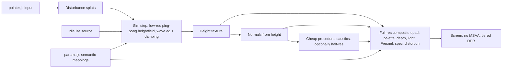

# Fluid

**INTERACTIVE WATER STUDY**

*a digital study of water, light, and motion*

---

## Concept

Fluid is a full-screen browser experience that treats water as both subject and interface. It is a calm, tactile study of light and motion—not a simulator, game, or conventional web app. The user is invited to touch, tune, and linger; there is nothing to complete.

Code is used here as a visual and interactive medium. Quality of feeling matters more than technical completeness.

---

## Core Question

> Can a browser interaction feel calming without asking the user to accomplish anything?

---

## Product Principles

1. **Water is the interface** — The surface fills the screen; UI stays secondary and intentional.
2. **Calm over spectacle** — Prefer gentle presence over dramatic effects.
3. **Interaction without objectives** — Response is sensory, never task-driven.
4. **Visual quality over feature quantity** — One beautiful surface beats many incomplete techniques.
5. **Subtlety over simulation complexity** — Believable feel first; physical accuracy only if it serves feeling.
6. **Responsive but not hyperactive** — Motion answers the user, then settles; never frantic.
7. **Performance is part of the experience** — Stutter breaks calm; frame stability is aesthetic.
8. **Controls should feel sensory, not technical** — Human-readable language; no raw shader jargon in production UI.

---

## Visual Direction

### Reference image observations

Two primary references (shallow pool water, top-down, no environment):

- **Shared:** Full-frame water; cyan/blue/turquoise range; luminous caustic networks; soft rippling distortion; glassy highlights; no horizon, skybox, floor tiles, foam, or scenery.
- **Reference A (cooler):** Deeper cerulean with navy troughs; sharper white caustic web; clear specular glints; faint concentric ripple suggesting localized disturbance.
- **Reference B (brighter):** Turquoise / aqua luminosity; denser, slightly softer caustic mesh; same edge-to-edge abstract composition.

**Default lean:** cooler deep blue (Reference A), while keeping overall mood a balanced blend—not extremely dark and not extremely turquoise.

### Style blend (binding)

- **Realistic light behavior**, but **artistic and stylized** overall—not photo-real ocean rendering.
- Caustics: **start softer**; introduce **sharper caustic webs** in a later visual phase once the surface is stable.
- Lighting: **crisp caustic behavior** combined with otherwise **soft lighting**.

### Color direction

- Base palette: cool blues / deep cyan with luminous white highlights.
- Public control: **warm ↔ cool** plus a **full hex-code color picker** (not presets-only).
- Subtle chromatic variation is desirable; avoid tropical beach clichés.

### Lighting

- Soft ambient fill + directional contribution for form.
- Specular / glassy highlights where the surface catches light.
- Caustic-like luminous streaks as a defining character trait (soft first, sharper later).

### Surface behavior

- Gently alive idle motion (soft overlapping ripples).
- Organic, non-repeating patterns—avoid flag/fabric wave look.
- Infinite, edge-to-edge field; no pool walls or world edges.

### Camera angle

- **Strict top-down.**
- Prefer orthographic (or equivalent top-down framing) so the surface reads as a continuous plane.
- Water fills the viewport completely.

### Caustics

- Essential to the look; secondary to calm motion early on.
- Progression: soft luminous hints → sharper web-like structure when approved.
- Should feel pool-like, not disco or noisy.

### Reflectivity / translucency

- Glassy regions and view-angle–dependent brightness.
- Public axis: **reflective ↔ translucent**.
- No environment map of scenery; reflections stay abstract / self-contained.

### Distortion

- Soft refractive / liquid-glass distortion of subsurface light patterns.
- Gentle, not warping or nauseating.

### What to avoid

- Hyper-realistic ocean simulation
- Horizons, skyboxes, environment scenery
- Foam, boats, rocks, tropical beach aesthetics
- Heavy UI chrome / “tech demo” styling
- Rapid flashing or intense motion
- Feature creep disguised as visual polish

---

## UX Principles

- **Full-screen experience** — Canvas is the page; water is primary.
- **No onboarding** — No “touch the water” hint; discovery is natural.
- **Minimal UI** — Controls hidden/collapsed by default; revealed via small corner icon and keyboard shortcut.
- **Discoverable interactions** — Subtle proximity response + stronger move/click/tap response.
- **Idle state** — Gently alive baseline; after interaction, return to calm gradually and organically (**no obvious fixed timer**).
- **Pointer behavior** — Proximity influence; velocity strengthens disturbance; click/tap ripple; hold behavior **undecided** (do not lock in).
- **Touch behavior** — **Single-touch only for MVP**; gestures should feel natural; portrait composition adapted carefully (not naive crop).
- **Reduced motion** — Honor `prefers-reduced-motion` as a default hint, but **let the user choose** the reduced-motion behavior rather than forcing a single policy.
- **Keyboard** — Opens and tunes controls only; **no keyboard-triggered ripple**.
- **Mobile expectations** — Graceful visual downgrade; same calm intent; single touch; portrait-aware framing.
- **Settings persistence** — Controls **reset every visit**; do **not** persist to `localStorage`.
- **Browser title** — `Fluid`
- **Audio** — Future possibility only; **not MVP**.

---

## MVP Scope

### MVP (deliberately small)

- Full-screen WebGL water surface (Vite + Three.js + custom GLSL)
- Strict top-down, edge-to-edge infinite feel
- Custom vertex + fragment shaders with slow procedural motion
- Believable soft lighting and highlights; soft caustic-like luminosity (sharp caustics later)
- Cooler deep-blue default palette with balanced mood
- Simple pointer influence (proximity + velocity)
- Click / tap ripple
- Idle calming that feels organic (no hard countdown UX)
- Public tunable parameters (human-readable):
  - calm ↔ restless
  - glassy ↔ turbulent
  - warm ↔ cool
  - reflective ↔ translucent
  - light
  - full hex-code color selection
- Custom minimal control panel (corner icon + keyboard shortcut); reset on each visit
- Responsive desktop / mobile canvas with portrait-aware composition
- User-selectable reduced-motion behavior
- Desktop-first quality; graceful mobile downgrade; drop expensive effects before falling below ~30fps on mid-range mobile
- Pause rendering when tab is hidden
- Static Vercel deployment

### Nice-to-have

- Phase 6.5 caustic study polish after visual feedback (density / sharpness / warp)
- Hold-to-disturb (once behavior is decided)
- Soft fade-in / polished control transitions
- Social preview image / richer metadata
- Low-power explicit fallback mode beyond automatic downgrades
- Subtle chromatic aberration or optical nuance (only if calm is preserved)

### Future experiments

- Audio (ambient / water-responsive)
- Multi-touch influence
- Splash-like moments (evaluate by feel)
- ~~GPGPU / ping-pong heightfield simulation (only if simple math ripples fail to feel right)~~ — **adopted 2026-09-29**; see [Architectural Pivot](#architectural-pivot)
- Additional sensory macro controls
- Persistence of settings (explicitly out of current product decision)

---

## Technical Architecture

### Stack (confirmed)

| Layer | Choice | Notes |
|-------|--------|--------|
| Build | Vite | Static site; fast HMR; Vercel-friendly |
| Runtime | Vanilla JavaScript | No React unless a clear need appears later |
| Renderer | Three.js `WebGLRenderer` | Scene, camera, resize, animation loop |
| Material | `ShaderMaterial` + custom GLSL | Vertex + fragment as separate modules |
| Dev controls | Tweakpane (temporary) | Swap for custom minimal UI before production polish |
| Deploy | Vercel | Static Vite output only |

**Avoid unless scope changes:** backend, serverless functions, databases, auth, external APIs, heavy postprocessing stacks, physics engines.

### Suggested project structure

```text
fluid/
  PROJECT.md
  index.html
  package.json
  vite.config.js
  public/
    favicon.svg
    og-image.png          # later (Phase 10)
  src/
    main.js               # bootstrap
    app/
      createApp.js        # scene / camera / renderer / loop
      resize.js
      visibility.js       # pause when tab hidden
    render/
      createWaterMesh.js  # plane + ShaderMaterial wiring
      camera.js           # top-down setup
    shaders/
      water.vert.glsl
      water.frag.glsl
    interaction/
      pointer.js          # proximity, velocity, click/tap
      idleCalm.js         # organic return toward calm
    controls/
      devGui.js           # Tweakpane (dev phases)
      panel.js            # custom production panel
      params.js           # centralized tunable state
    style.css
```

Preserve clear separation: **app setup · rendering · shaders · interactions · controls**.

### Three.js scene

- One full-screen (or oversized) plane; water is the only subject.
- Strict top-down camera; framing keeps the surface edge-to-edge at all aspect ratios.
- Portrait: adapt plane scale / camera framing carefully so composition still feels like continuous water (not a cropped desktop shot).

### Geometry

- `PlaneGeometry` with modest segment count—enough for vertex displacement, not excessive.
- Prefer fragment-driven detail (normals, caustics, color) over huge meshes.

### Shaders & uniforms

- Vertex: displacement / wave contribution.
- Fragment: color, lighting, Fresnel-like terms, distortion, caustic-like highlights.
- Uniforms clearly named and documented; experimental values centralized in `params.js` (or equivalent).

### Animation loop

- `requestAnimationFrame` via Three.js or thin wrapper.
- Pass time, pointer state, and params into uniforms each frame.
- Pause when `document.visibilityState === 'hidden'`.

### Pointer input

- Normalized device / UV-space coordinates.
- Track position, velocity, down/up for click-tap ripples.
- Single-touch path on mobile for MVP.
- Hold behavior left open in code design (pluggable, not committed).

### Responsive resize

- Update renderer size, camera, and any aspect-dependent uniforms.
- Cap `devicePixelRatio` (e.g. 1.5–2 on desktop; lower on mobile as needed).

### Performance strategy

- Target **60fps** where practical; accept **30–60fps** on mobile.
- Desktop visual quality first; **drop expensive effects** before sustained sub-30fps on mid mobile.
- Adaptive pixel ratio; visibility pause; avoid oversized geometry and unjustified textures/postprocessing.

### Control panel architecture

- **Development:** Tweakpane bound to centralized params.
- **Production:** Custom minimal panel; same params object; corner icon + keyboard shortcut; no `localStorage`.

### Vercel deployment

- Standard Vite static build (`vite build` → `dist`).
- No server-side architecture.

---

## Shader Strategy

Progress incrementally. **Do not attempt all steps at once.**

1. Simple sine-wave displacement  
2. Layered wave functions / careful noise  
3. Procedural normals  
4. Height-based color  
5. View-angle calculations  
6. Directional light  
7. Specular highlights  
8. Fresnel  
9. Refraction / distortion  
10. Soft caustic-like highlights → later sharper caustic webs  

Each roadmap phase maps to a subset of this ladder. Prefer readable shader code over clever abstractions.

---

## Interaction Strategy

**Start simple (mathematical / CPU-side influence into uniforms):**

- Pointer coordinate influence (including subtle proximity)
- Fake mathematical ripple on click/tap
- Velocity-based disturbance strength
- Organic idle calming (continuous easing toward baseline—not a visible timer)

**Only consider later if simple approach cannot achieve the desired feel:**

- Framebuffer simulation  
- Ping-pong FBO  
- `GPUComputationRenderer` / GPGPU heightfields  

Hold behavior remains an **open question**; do not implement a locked hold model until decided.

> **Superseded 2026-09-29:** profiling showed the simple math approach cannot feel tactile (no shared state). The ping-pong heightfield fallback is now adopted — see [Architectural Pivot](#architectural-pivot) and [Replacement Roadmap](#replacement-roadmap).

---

## Controls Strategy

### Development

- Temporary **Tweakpane** (or equivalent) for rapid tuning.
- May expose more parameters than production.

### Production (binding)

| Control | Intent |
|---------|--------|
| calm ↔ restless | Overall motion energy |
| glassy ↔ turbulent | Surface character / roughness of motion |
| warm ↔ cool | Temperature shift of palette |
| reflective ↔ translucent | Optical balance |
| light | Illumination intensity / presence |
| hex color | Full color input/picker (base water hue) |

- Small, unobtrusive, collapsed by default  
- Reveal: **corner icon + keyboard shortcut**  
- Labels human-readable; no raw shader variable names  
- **Reset every visit** (no persistence)  
- Visually secondary to the water  

---

## Performance Budget

- Smooth **60fps** target on typical desktop  
- Acceptable **30–60fps** on mobile; prefer dropping effects over prolonged sub-30fps on mid-range devices  
- Adaptive / capped `devicePixelRatio`  
- Pause rendering when tab is hidden  
- Avoid oversized geometry  
- Avoid unnecessary postprocessing  
- No huge textures unless justified  
- Lazy-load anything nonessential  
- Low-power / reduced-effect fallback path as needed for mobile gracefulness  

---

## Accessibility

- Respect `prefers-reduced-motion` as an initial signal, but **allow the user to choose** reduced-motion behavior in the UI  
- Keyboard access for opening and operating controls  
- Readable control labels  
- Sufficient contrast on UI chrome (water itself may be low-contrast by nature)  
- No essential experience path that requires pointer-only **for controls**; water play may remain pointer/touch-primary  
- Avoid rapid flashing / intense motion  
- Provide a way to reduce motion intensity (via calm control and/or reduced-motion choice)  
- No keyboard-triggered ripple required  

---

## Development Roadmap

Highly incremental. **Never implement multiple phases without approval.**  
At the start of every coding session: **read this file first.**  
After each phase: summarize changes, explain important shader math in plain English, list what to evaluate manually, and ask whether to tune or proceed.

> **Status 2026-09-29:** Phases 0–6.5 are complete and define the visual target. **Phases 7–10 are paused** in favor of the [Replacement Roadmap](#replacement-roadmap). Phase 7 (idle calm) folds into simulation damping and the Stage D idle source; Phases 8–9 fold partly into Stage F; remaining Phase 8 items and Phase 10 resume after Stage G.

### PHASE 0 — Setup

**Goal:** Project foundation only.

**Tasks:** Vite, Three.js, basic canvas, resize handling, scene/camera/renderer, plain test plane, Vercel sanity deploy.

**Exit criteria:** Empty Three.js scene renders; responsive canvas works; deployment works; **no water visuals yet**.

**STOP** — ask for approval.

### PHASE 1 — Basic Water Surface

**Goal:** First visual water study.

**Tasks:** Plane + custom `ShaderMaterial`; simple vertex displacement; 2–3 layered sine waves; slow movement; basic blue/cyan gradient (cooler deep-blue lean).

**Exit criteria:** Water-like calm motion; no pointer interaction; no Fresnel / refraction / caustics / controls.

**STOP** — ask for visual feedback.

### PHASE 2 — Surface Character

**Goal:** More organic surface.

**Tasks:** Layered procedural motion; careful noise; improved procedural normals; height-based color; tune scale/frequency.

**Exit criteria:** No longer flag/fabric-like; begins to resemble references; still calm.

**STOP** — ask for visual feedback.

### PHASE 3 — Lighting

**Goal:** Light defines the surface.

**Tasks:** Directional lighting; specular highlights; view-dependent brightness; **soft** caustic-like streaks if feasible (sharp webs later).

**Exit criteria:** Luminous depth; pool-inspired highlights without noise.

**STOP** — ask for visual feedback.

### PHASE 4 — Fresnel + Optical Effects

**Goal:** Liquid / glass character.

**Tasks:** Fresnel; reflective ↔ translucent balance groundwork; subtle refraction/distortion; color depth adjustments.

**Exit criteria:** More liquid/glassy; believable view-angle behavior; no expensive effects without justification.

**STOP** — ask for visual feedback.

### PHASE 5 — Pointer Interaction

**Goal:** Water responds to the user (simple math first).

**Tasks:** Normalized pointer coords; proximity influence; velocity detection; click/tap ripple; organic idle calming. **Do not lock hold behavior.**

**Exit criteria:** Organic, subtle response; not game-like; single-touch mobile works.

**STOP** — ask for interaction feedback.

### PHASE 6 — Controls

**Goal:** Tunable experience.

**Tasks:** Dev controls first for motion, optical, light, color axes; then custom minimal UI with the binding public set (including hex color); corner icon + keyboard shortcut; no persistence.

**Exit criteria:** Only useful public parameters; human-readable labels; UI does not overpower water.

**STOP** — ask for UX feedback.

### PHASE 6.5 — Caustic Study *(roadmap pause — before Phase 7)*

**Goal:** Fine-scale, animated, interconnected caustic light networks inspired by the reference images — the missing micro layer between broad water motion and concentrated sunlight.

**Context:** Phase 1–6 establish organic motion, depth, optics, interaction, and controls. Soft `softCaustics` only brightens existing mid-scale lit ridges and cannot produce thin branching webs. Do **not** proceed to Phase 7 until this study is visually approved (or explicitly deferred).

**Tasks:**
- Inspect why current soft caustics read as broad ridges (not fine networks)
- Implement a dedicated procedural caustic field (prefer single-pass shader; no static caustic texture unless justified)
- Preserve macro water; caustics ride on / emerge from it
- DEV-only temporary controls (intensity, density/scale, sharpness, warp, speed); do not dump into production panel
- Keep pointer, idle, hold, and unrelated Phase 1–6 systems unchanged unless required for compatibility

**Visual target:** Thin luminous lines; irregular cellular branching; varying thickness/brightness; brighter intersections; continuous organic evolution; no tiling / grid / zebra / lightning / cracked-glass look; pale cyan → blue-white (rare near-white nodes); start moderately dense.

**Exit criteria:** Fine caustic network clearly distinct from broad ridges; evolves with the water; reads substantially closer to sunlit pool references; calm preserved; mobile remains performant (~60 desktop / effects drop before sustained &lt;~30 mobile).

**STOP** — ask for visual feedback; do **not** proceed to Phase 7.

### PHASE 7 — Calm / Idle Behavior

**Goal:** Inactivity is part of the experience.

**Tasks:** Detect idle in a soft way; gradually reduce disturbance; return toward calm baseline organically; refine calm ↔ restless as macro if needed.

**STOP** — ask for feedback.

### PHASE 8 — Mobile + Accessibility

**Tasks:** Touch tuning; user-selectable reduced motion; keyboard control access; viewport / portrait framing; DPR strategy; orientation testing; mobile effect downgrades.

**STOP** — ask for approval.

### PHASE 9 — Performance

**Tasks:** Measure frame/GPU cost; optimize geometry/shader work; adaptive DPR; visibility pause; test integrated GPU / mobile; **report findings before cutting visual quality**.

**STOP** — report findings.

### PHASE 10 — Polish

**Tasks:** Soft fade-in; control transitions; favicon/title/metadata (`Fluid`); loading only if needed; screenshot / social preview; final responsive pass; production Vercel deploy.

**Optional later (post-MVP):** sharper caustics; hold behavior; audio experiments.

---

# Architectural Pivot

*Decided 2026-09-29, after the architecture profiling pass. This is a **partial** replacement, not a rewrite.*

**Keep:** Vite · Three.js · `WebGLRenderer` / WebGL2 · orthographic top-down camera · Vercel · existing app shell · approved palette · approved lighting / optical ideas where practical · current caustic appearance as a **visual reference** · public UI concept · pointer / touch input handling where reusable.

**Replace:** the stateless procedural surface as the primary interaction surface · the stateless analytic ripple system · the expensive full-resolution caustic implementation.

**New direction:** low-res GPU water simulation **+** full-res visual composite **+** cheaper procedural caustics.

### 1. Why the original stateless approach was insufficient

- Every vertex (surface) and every pixel (caustics) evaluates height and light as `f(position, time, uniforms)`. Nothing persists between frames — there is **no shared water state**.
- Without state, a touch cannot leave a trail, energy cannot travel outward, ripples cannot interfere with each other or the idle waves, and the surface cannot settle on its own. Those are exactly the tactile qualities this project wants ("responsive but not hyperactive", "return to calm organically").
- Pointer influence is visually weak relative to idle motion: the proximity bump's peak slope is ~0.02 and the wake's ~0.03, against ~0.24 for the idle waves. Lighting is slope-driven, so the pointer barely changes the image.
- The wake is shaped around the *current* cursor position only and vanishes ~100 ms after the pointer stops. Tap ripples are 4 closed-form slots (`A·sin(k·r − ω·t)·e^(−αr)·e^(−βt)`) that ignore each other and the waves.
- Adding "memory" through more uniforms makes every pixel's formula longer and more expensive. The approach scales in the wrong direction.

### 2. What the profiling revealed

**Measured** (Apple M2, Chromium via ANGLE/Metal, `EXT_disjoint_timer_query_webgl2`, one draw per frame):

| Finding | Value |
|---------|-------|
| Full fragment shader at 1920×1080 | ~9.0 ms |
| Fine caustic network (2 Worley passes + 5 value-noise calls) | ~6.9 ms (**~77%** of fragment time) |
| Fragment shader with caustics removed | ~2.1 ms |
| Second Worley pass alone | ~2.6 ms |
| 4× MSAA on a full-frame plane | +2.7 ms (+27%), no visible benefit (no silhouette edges) |
| Vertex stage (80×80 grid, height evaluated 5× per vertex) | ~0.2 ms |
| Fresnel + specular + color model + soft streaks combined | ~1.5 ms above bare fill |
| Live page, 1706×1544 buffer (2.63 MP) | ~10–11 ms GPU, 60 fps |
| Idle vs hover vs 4 active ripples | no measurable difference |
| Shader compile + link | ~200 ms uncached, ~15 ms cached |

**Known from code:** DPR capped at 2 for every device; no quality ladder, adaptive resolution, or effect downgrade; full-quality shader starts immediately; no fallback if WebGL context creation fails; the 80×80 grid undersamples higher turbulence and stretches along the long axis in portrait (visible faceting).

**Inferred (not measured):**
- Full-screen 13" Retina (~5.6 MP) → ~21–34 ms per frame, i.e. 30–45 fps even on an M2.
- Mid-range phones → roughly 25–80 ms per frame.
- The Lighthouse "page stopped responding" failure is most plausibly headless Chrome running WebGL through a software rasterizer (SwiftShader), executing this shader on the CPU every frame. Not confirmed by a Lighthouse run.

**Controls:** "great at default, bad quickly" comes from shading thresholds tuned to the default slope/height range (`smoothstep` slope gates, `vHeight × 9` / `× 14`, `NdotV^11.5` Fresnel expansion), deliberately amplified mappings (×2.8, ×6, `^1.65`), a glassy↔turbulent default at only 14% of its travel, additive light with a hard `clamp` and no tone mapping, and ambient / specular colors hard-coded cyan regardless of the chosen hex.

### 3. Why Three.js / WebGL2 is retained

- The renderer, camera, and one-draw pipeline were measured as **sound**. The cost is in shader *content*, not the framework.
- WebGL2 provides what a simulation needs: float / half-float render targets and multi-pass ping-pong through `WebGLRenderTarget`.
- Keeping it preserves Vite, Vercel, the app shell, the control panel, and the input code — avoiding an unnecessary rewrite.

### 4. Why the water core is being replaced

- A low-resolution GPU heightfield (discrete wave equation + damping) gives real shared state for roughly 0.1–0.5 ms per step *(inferred)*: propagation, interference, trails, natural decay, and direct pointer writes.
- Height and normals come from a texture sampled bilinearly at full resolution instead of being interpolated across an 80×80 vertex grid, removing the grid faceting.
- A simulation exposes physically meaningful parameters (wave speed, damping, injected energy) that semantic controls can map onto cleanly, instead of one slider fanning out to ~14 coupled uniforms.

### 5. Why caustics will later be rebuilt more cheaply

- They are the dominant GPU cost (~77% of fragment time) and the main mobile and Lighthouse risk.
- They are only loosely coupled to the surface: the surface nudges where the web is sampled (~0.015 world units under the cursor vs ~0.5-unit cells), but a ripple cannot carve the web.
- The approved look is a **parameter set and design** — Worley F2−F1 lines, brighter intersections, varying thickness, palette-derived tints — not an engine. It can be rebuilt at ≤ ~1/3 of the cost with simulated normals driving the warp.
- They are rebuilt only after the new surface exists (Replacement Roadmap Stage E), so they are designed around the real surface rather than the old one.

### 6. Existing visual work being preserved

Regardless of implementation, these must survive the replacement:

- **Palette:** `#2a7a9c` / `#3f9bb8` / `#6bc4d4`; `derivePalette` with `MID_OFFSET` / `SHALLOW_OFFSET`; the HSL formulas that derive `uCausticTint` / `uCausticHot` from the shallow stop.
- **Color-space behavior:** palette colors are written via `setRGB` / `setHSL` (no sRGB→linear conversion), while `LIGHT` hex colors *are* linear-converted by Three.js. A port must reproduce this mix or the approved colors will shift.
- **Lighting and optics:** `LIGHT` and `OPTICS` values — dual-lobe Blinn-Phong specular, Schlick Fresnel with `fresnelViewContrast` 11.5 (the top-down Fresnel fix), reflective ↔ translucent blend, normal-tied distortion, color-depth model.
- **Caustic visual reference:** `CAUSTIC_NET` baseline (intensity 1.10, scale 2.0, sharpness 0.375, warp 0.42, speed 0, soft 0.13), `CAUSTIC_CLAMPS`, the Worley F2−F1 design, and a golden reference screenshot captured before Stage A.
- **Macro surface character:** `WAVE_A`–`WAVE_D` directions / frequencies and `NOISE` scales, as the target for idle motion.
- **Input handling:** `clientToWorld`, Pointer Events + Touch Events fallback, single-touch logic, `TAP_MOVE_THRESHOLD`, `setSuppressed` during UI use, reduced-motion attenuation.
- **App shell:** orthographic top-down camera and aspect framing (`resize.js`), visibility pause, `dt` clamp, skipping wall-clock time while hidden.
- **Public UI:** axis names (calm ↔ restless, glassy ↔ turbulent, reflective ↔ translucent, light, hex), panel UX (corner icon, collapsed by default), reset every visit.

### 7. New intended rendering pipeline



Per frame:

1. **Input** — `pointer.js` converts pointer / touch into queued disturbance splats (position, radius, strength from velocity).
2. **Simulation** — N fixed-timestep substeps on a low-res, aspect-matched ping-pong heightfield (half-float): wave equation + damping + splats + idle life source.
3. **Normals** — derived from the height texture (central differences), inline or as a small pass.
4. **Caustics** — cheap procedural field warped by simulated normals; optionally rendered at reduced resolution.
5. **Composite** — one full-screen quad at display resolution: palette / depth color, lighting, Fresnel, specular, distortion, caustic contribution.
6. **Screen** — no MSAA; device pixel ratio chosen by a quality tier.

**Expected module layout** (created incrementally, stage by stage):

| File | Role | Stage |
|------|------|-------|
| `src/sim/createWaterSim.js` | Render targets, step, splat queue, resize | A–B |
| `src/shaders/sim/simStep.frag.glsl` | Wave equation, damping, splats | A–B |
| `src/shaders/fullscreen.vert.glsl` | Shared full-screen quad vertex | A |
| `src/shaders/simDebug.frag.glsl` | Height / normal debug views | A–C |
| `src/shaders/sim/simSurface.glsl` | Shared sim height / normal sampling (central differences; optional cubic B-spline height — default for the water view) | C |
| `src/interaction/simPointer.js` | Pointer / touch → sim segments and impulses (`?sim` path; `pointer.js` stays for the default app) | B |
| `src/render/createSurfaceComposite.js` | Full-screen composite material wiring (`SIM_HEIGHT_SCALE`, shading uniforms at approved defaults) — implemented | D |
| `src/shaders/surface.frag.glsl` | Ported shading consuming sim height / normals — implemented (no caustic network) | D |
| `src/render/lookConstants.js` | Palette, `LIGHT`, `OPTICS`, `CAUSTIC_NET` moved out of `createWaterMesh.js` — **deferred** (Stage D imports them from `createWaterMesh.js`) | D |
| `src/shaders/causticsLegacy.glsl` + `src/render/legacyCausticsDev.js` | Dev-only E0 comparison harness: legacy Phase 6.5 network (verbatim math) on the sim composite; imported only by the `?sim` debug app; retired with the legacy pipeline — implemented | E0 |
| `src/shaders/caustics.glsl` (+ `src/render/createCausticFieldPass.js`, `src/shaders/causticsFieldPass.frag.glsl`) | Rebuilt caustics — E1–E3 structure; **E4 approved `halfHybrid`** (½-res distances + display-res shaping); dev `causticRes=full|half|quarter|halfHybrid` until E7 routing | E1–E4 |
| `src/sim/idleSource.js` + idle block in `simStep.frag.glsl` | E3.5 idle velocity forcing on the sim grid (`?sim&water`; frozen 2026-10-06) | E3.5 |
| `src/render/createCausticCurvature.js` + `src/shaders/causticCurvature.frag.glsl` | E2 smoothed sim-height curvature (separable Laplacian-of-Gaussian, σ = 2 texels, two passes at sim resolution) for the caustic fold limit and concentration only; Stage C `simNormal` untouched — implemented | E2 |
| `src/render/quality.js` | Tiers, capability detection, frame-time monitor | F |

Modified along the way: `src/app/createApp.js` (sim step in loop, flags), `src/app/resize.js` (sim resize, DPR tiers), `src/interaction/pointer.js` (output becomes splats), `src/controls/params.js` (Stage G). Expected unchanged: `src/controls/panel.js`, `src/render/camera.js`, `src/app/visibility.js`, `index.html`, `vite.config.js`, `vercel.json`. Retired only after Stage E approval (owner decides): `src/render/createWaterMesh.js`, `src/shaders/water.vert.glsl`, `src/shaders/water.frag.glsl`, possibly `createCausticStudyGui` in `devGui.js`.

---

# Replacement Roadmap

**Process rules (binding):**

- One stage at a time. **Never implement multiple stages without approval.**
- Every stage ends in a small, working, evaluable result — then **STOP** for owner feedback.
- No giant rewrite: the old pipeline keeps working until the new one earns its place.
- During Stages A–C the new pipeline lives behind a `?sim` URL flag; the public app stays unchanged.
- From Stage D the new pipeline becomes the default; the old one stays reachable via `?legacy` for side-by-side comparison until Stage E is approved.
- Old files are retired only with explicit owner approval.

**Prerequisite before Stage A:** capture a golden reference screenshot of the current build at default settings (desktop landscape + phone portrait) and record the current performance baseline (~10 ms GPU at 2.63 MP on the M2). Every later visual comparison is made against these.

### Golden Reference Baseline

*Captured 2026-09-29, before any Stage A code. Current approved build (Phases 0–6.5), default public controls, no interaction.*

| View | File | Capture |
|------|------|---------|
| Desktop landscape | [`src/images/golden-reference-desktop.png`](src/images/golden-reference-desktop.png) | 1440×900 CSS px @ DPR 2 (2880×1800), headless Chrome, ANGLE/Metal on M2 |
| Phone portrait | [`src/images/golden-reference-portrait.png`](src/images/golden-reference-portrait.png) | 390×844 CSS px @ DPR 1.8 (702×1519), Chromium device emulation, ANGLE/Metal on M2 |

The portrait capture uses DPR 1.8 rather than 3 because the emulation surface could not hold a larger framebuffer. Framing depends only on the CSS viewport (and the app caps DPR at 2 anyway), so the composition matches a real phone. The surface animates continuously, so compare *character* (palette, depth, highlight density, caustic web scale), not exact pixels.

**Performance baseline** (from the 2026-09-29 profiling pass; Apple M2, Chromium via ANGLE/Metal, `EXT_disjoint_timer_query_webgl2`):

| Measure | Value |
|---------|-------|
| Full fragment shader at 1920×1080 | ~9.0 ms |
| Fine caustic network share | ~6.9 ms (~77% of fragment time) |
| Fragment shader without caustics | ~2.1 ms |
| 4× MSAA overhead | +2.7 ms |
| Vertex stage (80×80 grid) | ~0.2 ms |
| Live page, 1706×1544 buffer (2.63 MP) | ~10–11 ms GPU, 60 fps |

**Relationship to the original phases:** Phases 0–6.5 are complete and define the visual target. Phases 7–10 are paused. Phase 7 (idle calm) is absorbed by simulation damping and the Stage D idle source; Phases 8–9 (mobile, performance) are partly absorbed by Stage F; remaining Phase 8 items (reduced-motion choices, keyboard shortcut, orientation testing) and Phase 10 (polish) resume after Stage G.

### Stage A — Simulation proof of concept

**Goal:** Prove a stateful low-res heightfield runs cheaply and stably in this stack.

**Implements:**
- Ping-pong half-float render targets, aspect-matched to the viewport.
- Wave-equation step with damping, driven by a fixed-timestep accumulator.
- Dev-only automatic test drops (random positions on a timer).
- Debug view: full-screen quad showing height as a color ramp.
- Capability check for float / half-float render targets (clear console message if unsupported).
- All behind `?sim`.

**Does NOT implement:** pointer input, normals, lighting, palette, caustics, controls, quality tiers, removal of old code.

**Exit criteria:**
- Waves visibly propagate outward, interfere, and decay.
- No numerical blowup after several minutes.
- Same behavior at 30 / 60 / 120 Hz display rates (fixed timestep).
- Sim step GPU time measured (target < ~0.5 ms on the M2).
- Default app (no flag) is unchanged.

**Evaluate:**
- Simulation resolution: 128 / 192 / 256 on the long axis?
- Wave speed and damping ranges that feel calm rather than bouncy.
- Edge behavior: absorbing vs wrap — no visible box or reflections from screen edges.
- Half-float render-target support on iOS Safari.
- Do ripples still read as water when bilinearly upscaled?

**STOP** — ask for evaluation.

### Stage B — Pointer disturbance

**Goal:** The user's touch writes into the shared water state.

**Implements:**
- Reuse `pointer.js` input handling (coordinates, touch fallback, single touch, suppression, reduced motion); replace its analytic-ripple output with disturbance splats.
- Drag: splat along the full segment from previous to current position (no gaps); strength from velocity.
- Tap: a stronger single impulse.
- Still displayed through the debug view.

**Does NOT implement:** analytic ripples (not carried into the new path), normals, shading, hold behavior, control remapping.

**Exit criteria:**
- Drags leave trails that persist and spread.
- Taps ring outward; multiple taps interfere.
- Slow vs fast gestures are clearly distinguishable.
- Single-touch works on a real phone.
- Response feels immediate (no smoothing lag in the splat path).

**Evaluate:**
- Splat shape (Gaussian vs soft disc) and sign (push down vs lift).
- Does hover proximity (no press) stay, and how gently?
- Velocity curve and cap.
- Maximum injected energy that still feels calm.

**STOP** — ask for interaction feedback.

### Stage C — Simulation-driven normals

**Goal:** Smooth full-resolution normals derived from the height texture.

**Implements:**
- Central-difference normals from the height texture — inline in the full-res shader or as a separate normal pass at sim resolution, whichever compares better.
- A single normal-strength scalar.
- Debug views: normal visualization + a plain N·L directional light.

**Does NOT implement:** palette, Fresnel, specular, distortion, caustics.

**Exit criteria:**
- No texel blockiness or stair-stepping at full resolution on desktop or phone.
- Ripples read as smooth, lens-like bumps.
- The old 80×80 grid faceting is gone (including portrait).

**Evaluate:**
- Bilinear vs bicubic height sampling.
- Is sim resolution enough for fine ripples, or is a small procedural fine-normal detail needed?
- Inline normals vs separate pass (cost and quality).

**STOP** — ask for visual feedback.

### Stage D — Reconnect existing visual shading

**Goal:** The new surface wears the approved look (without caustics).

**Implements:**
- New full-screen composite (`surface.frag.glsl`) porting the shading stage of `water.frag.glsl`: height / slope color, dual-lobe lighting, Fresnel with the view-contrast fix, reflective ↔ translucent blend, distortion, color depth, soft streaks.
- Consumes sim height and normals instead of `vHeight` / `vNormal`.
- Normalize sim height / slope into the ranges the approved thresholds expect.
- Choose and add an idle life source.
- Move approved constants out of `createWaterMesh.js` into `lookConstants.js`.
- Wire the existing panel through the current mappings (temporarily; may misbehave off-default until Stage G).
- New pipeline becomes the default; `?legacy` stays available.

**Does NOT implement:** caustic rebuild (the legacy caustic function may be toggled under a debug flag purely for comparison), mapping rework, quality tiers.

**Exit criteria:**
- Side by side with the golden reference at defaults: body color, depth, highlights, and Fresnel read as the same family.
- Idle feels gently alive, not flat.
- Touches visibly change the lighting (the "weak" problem is solved).
- GPU cost measured.

**Evaluate:**
- Idle source: cheap procedural macro layer added in the composite, or gentle forcing injected into the simulation?
- Height / slope normalization values.
- Does the look drift because slope statistics differ from the old surface?
- Tap ripple visibility under lighting (owner found taps subtle in the Stage C normal view; revisit the Stage B tap impulse only if still too subtle).

**STOP** — ask for visual feedback.

### Stage E — Rebuild caustics around the new surface

**Goal:** The approved caustic look at a fraction of the cost, visibly bent by ripples.

**Implements:**
- Cheaper procedural caustic field: `sin`-free hash, one Worley pass (a second only if needed), fewer value-noise calls.
- Warp driven by simulated normals, strong enough that ripples carve the web.
- Optional reduced-resolution (e.g. half-res) caustic target, upsampled.
- Palette-derived caustic tints preserved.

**Does NOT implement:** physically traced caustics (photon / refraction mesh), quality-tier tuning.

**Exit criteria:**
- Close to the golden reference: thin branching lines, brighter intersections, varying thickness, no tiling / grid / zebra look.
- Cost ≤ ~1/3 of the old ~6.9 ms at 1080p on the M2.
- Ripples visibly bend the caustics.
- No shimmer on phones.
- `?legacy` can then be retired (owner approval).

**Evaluate:**
- Is reduced resolution crisp enough?
- One vs two Worley layers.
- Independent caustic animation (the old default speed was 0) or surface-driven only?
- Coupling strength between ripples and the web.
- A physically inspired alternative that follows where simulated normals converge.

**Approved sub-stages** (technical plan approved 2026-09-29; one sub-stage at a time, STOP after each):

- **E0 — Comparison harness** (approved): `?sim&water&caustics=off|legacy|new` (`new` = the rebuilt field, from E1), `&causticView` (caustic light only) / `&causticView=raw` (raw network); legacy network on the sim surface for same-surface A/B and a same-session cost baseline.
- **E1 — Cheapest procedural prototype**: sin-free (Hoskins) hash, one Worley 3×3 pass with arcsine-preserving static jitter and 2 `sqrt`, 2 `vec2` value-noise calls (was 5 scalar), fwidth-aware minimum line width; full-res inline in the composite; no coupling, no drift. — approved (limitations carried forward to E3 / E5; see decision log).
- **E2 — Surface coupling**: refraction-style bend (`p += N.xy·bend`, fold-limited) + concentration from smoothed sim-height curvature (separable σ = 2-texel LoG at sim resolution); drift modes compared. — **approved** (see decision log). Owner-preferred ambient drift candidate: Mode B (warp) at `causticDriftSpeed=0.06` (not final; code default still 0.015). Idle water source deferred to the dedicated idle-motion stage (below).
- **E3 — One vs two Worley layers** (approved): dev-only compile-time variants via `&causticVariant=1|2|3` on `?sim&water&caustics=new` — (1) one Worley layer = unchanged E2 field; (2) one layer + F3 junction nodes / strands from the same 3×3 search; (3) two sin-free Worley layers (second ×1.71) with crossing terms. Variant 4 not implemented. **Structural winner: Variant 3** (two sin-free Worley layers); Variants 1–2 remain for A/B. Omitting `causticVariant` still compiles variant 1 until a later sub-stage wires the winner as the default `caustics=new` path. Current V3 appearance is **not** approved as final caustics — see E5 carry-forward. Measured caustic Δ @ 1080p (E3 session, full E2 coupling): V1 ≈ 2.33 ms, V2 ≈ 3.12 ms, **V3 ≈ 3.76 ms** (exceeds ≤ ~2.3 ms Stage E budget; do not optimize in E3 — E4 targets recovery).
- **E3.5 — Idle motion** (**approved 2026-10-06**; re-verified same day after shader-link regression fix): low-res sim **velocity forcing only** (sin carriers + idle-only height headroom via `uIdleHeightCap`) in `simStep.frag.glsl`, defaults in `idleSource.js`. **Frozen (no retune without owner approval):** `IDLE_DEFAULTS` (`strength` 0.0007, `spatial` 96, `speed` 0.08, `mix` 1, `layers` 2, `midWeight` 0.55, `heightCap` 0.12), Stage A/B sim + `simPointer.js`, E2 `CAUSTIC_COUPLING` defaults, E3 **Variant 3** caustic structure (layer count, crossings, compile-time variant logic). Mode B warp drift **evaluation candidate** remains `causticDriftSpeed=0.06` via URL; code default still `0.015`. **Primary Stage E dev stack** (idle on = omit `idle=off`; binding for E5+ eval):

  `?sim&water&caustics=new&causticVariant=3&causticDrift=warp&causticDriftSpeed=0.06&causticRes=halfHybrid`

- **E4 — Reduced resolution** (**approved 2026-10-07**): **`halfHybrid` frozen** as the chosen caustic-resolution approach for Variant 3 — Worley edge distances at ½ buffer res (RG) + line shaping / gate / composite at display res (`createCausticFieldPass.js`, `CAUSTIC_PASS_HYBRID`). Owner: visually close enough to `causticRes=full`; performance gain justifies the tradeoff. **`half` / `quarter` / `full`** remain dev-only comparisons via URL; do not retune the hybrid pass architecture without owner approval. `causticView=fold|conc` still forces full-res inline field (debug). Sim, idle, pointer, and E2 coupling unchanged. **Not changed by E4 approval:** public app, control panel, `index` bundle, or dev resolver default (`causticRes` still defaults to `full` in code until **E7** wires the approved stack).

#### E4 evaluation plan *(completed 2026-10-07)*

*Goal:* pick a reduced-res caustic path that recovers Stage E GPU budget **without** visible quality regression on the approved Variant 3 structure, on living idle water.

**1. Session setup**

- Use the **primary idle stack** URL above on desktop landscape (golden framing ~1440×900) and phone portrait (~390×844).
- Structural comparison: **Variant 3 only** (`causticVariant=3`). Variants 1–2 are not E4 targets.
- Toggle only `causticRes`: `full` (baseline), `half`, `quarter`, `halfHybrid`. Keep all other params fixed.
- Optional isolates: `&causticView=raw` (network structure), default view (gated composite), and the same tap / drag gestures used in E2–E3.

**2. Visual checklist** (each mode vs `full` on the same stack)

| Question | Pass hint |
|----------|-----------|
| Thin strands and intersections still read as pool-like (not mushy or beaded)? | `halfHybrid` often best for thin lines; `quarter` is the stress test |
| Line width floor (~2 px `fwidth`) still anti-aliases cleanly on portrait? | Watch lower corners and 4× crop |
| Idle + warp drift motion unchanged in character (no new scrolling / pulsing)? | Compare side-by-side at 0 / 30 s |
| Ripples / wakes still bend and concentrate the web? | Same gestures as E2 approval |
| Temporal stability (no shimmer worse than `full`)? | Slow drag + hold still on idle water |
| Obvious upsample blur, blockiness, or moiré on bright nodes? | Disqualifies a mode unless cost win is large |

**3. Performance checklist** (same method as E1–E3: paired, interleaved, saturated composite renders; report **caustic Δ** vs `caustics=off`, not absolute clock)

- **Reference:** E3 full-res V3 caustic Δ ≈ **3.76 ms** @ 1080p (same coupling); Stage E target ≤ **~2.3 ms** (⅓ of legacy ~6.3–6.6 ms).
- Measure at **1920×1080 @ DPR 1** and **portrait 780×1688 @ DPR 2** (or the owner’s real phone): `full`, `half`, `halfHybrid`, `quarter` on the primary stack.
- Note extra cost of the field pass + curvature pass (curvature unchanged); expect largest savings on V3 (two Worley layers).
- **E6** will re-baseline absolute numbers; E4 only needs a **within-session ranking** and whether any mode meets the ≤ ~2.3 ms target at 1080p.

**4. Decision outcome** — **Approved `halfHybrid`** (2026-10-07). `half` and `quarter` not promoted.

**5. Follow-up** — **E5 planning** recorded below; **E5 implementation not started.** E6 verifies budget on the frozen hybrid path; E7 proposes production routing (`causticVariant=3`, `causticRes=halfHybrid`, drift `0.06`); Stage F encodes resolution in tiers.

- **E5 — Visual match** (**implemented 2026-10-07**, awaiting owner evaluation — [E5 evaluation plan](#e5-evaluation-plan)): on **frozen Variant 3 + `halfHybrid`** only; soften lines; reduce razor-sharp / cracked-glass / Voronoi read; stronger thick ↔ thin variation; preserve fine strands without fine structure everywhere; more open / quiet regions and occasional larger cells; stronger spatial scale mix (fine / medium / large); preserve natural bright intersections; recover Variant 1’s soft broad luminous quality and legacy’s scale/thickness variation (soft broad bands, medium lines, fine strands, quiet areas) **without** simply blurring the whole field; gate / pulse / tints / intensity rebaseline vs golden + legacy port on the sim surface. **Do not** add structural complexity beyond Variant 3; **do not** change `halfHybrid` pass split or idle / E2 coupling.

#### E5 evaluation plan

*Goal:* bring the **approved E3 Variant 3 structure** on **`halfHybrid`** closer to the golden reference and legacy port **character** (softness, scale mix, brightness distribution) while keeping pool-like calm and mobile stability. **Out of scope until explicit E5 approval to implement:** any code change; public `params.js` / `panel.js` mapping; production or default-app routing; E6/E7 work.

**1. Frozen baseline (do not change in E5 planning or later E5 work without owner approval)**

| Layer | Frozen |
|-------|--------|
| Caustic structure | E3 **Variant 3** (two Worley layers, crossings; no third layer, no F3-only path) |
| Resolution path | E4 **`halfHybrid`** (½-res distances + display-res shaping) |
| Water motion | E3.5 idle forcing + Stage A/B sim + `simPointer.js` |
| Surface coupling | E2 bend / fold limit / curvature concentration / drift modes (URL candidate `0.06` unchanged) |
| Product surface | Default public app, control panel, `deriveCausticParams` behavior |

**2. Dev session setup** (when implementation is approved)

- **Canonical URL:** [primary Stage E dev stack](#stage-e--rebuild-caustics-around-the-new-surface) above (`causticRes=halfHybrid` required).
- **References (same session, same surface):** golden screenshots ([desktop](src/images/golden-reference-desktop.png) / [portrait](src/images/golden-reference-portrait.png)); `?sim&water&caustics=legacy` on the primary stack (character + scale, not pixel match); optional `causticVariant=1&causticRes=full` + `causticView=raw` for **softness target only** (not structure).
- **Views:** default composite; `causticView=raw` for line/cell structure; interaction spot-checks (tap, slow/fast drag) to ensure coupling still reads after any E5 shader tuning.

**3. Visual targets** (owner checklist from E3 carry-forward + Phase 6.5 intent)

| Target | Avoid |
|--------|--------|
| Softer line profile; less razor / cracked-glass / Voronoi | Whole-field blur or lowered resolution |
| Stronger thick ↔ thin; legacy-like broad luminous bands + fine strands | Uniform line weight everywhere |
| More quiet / open water between networks; occasional larger cells | Empty or flat “no caustics” deserts |
| Multi-scale mix (fine + medium + some large) without noise everywhere | Extra Worley passes or new structural features |
| Natural bright intersections and pale nodes; rebaselined peak brightness vs golden | Disco flashing, zebra tiling, lightning filaments |
| Calm preserved under idle + `causticDriftSpeed=0.06` candidate | Independent fast caustic animation |

**4. Likely tuning surface in E5 implementation** *(constants / shaping only — not structural)*

- Approved semantic baseline: `CAUSTIC_NET` / `CAUSTIC_CLAMPS` / palette-derived `uCausticTint` / `uCausticHot` (same family as legacy).
- Shaping in `caustics.glsl`: ridge width / `sharpness` mix, thickness noise, brightness pulse lattice, crossing-term weights, `netGate` / slope-height gates, composite `·0.42` and intensity clamps — tuned on **`halfHybrid`** so display-res shaping stays authoritative.
- **Explicit non-goals:** change `CAUSTIC_VARIANT` topology; replace hybrid pass with `half` or `quarter` upsample; move bend/conc to a new data source; expose new production sliders (Stage G may remap later).

**5. Exit criteria** (for E5 approval STOP)

- Side-by-side with golden + legacy port: reads substantially closer in **softness, scale variation, and brightness hierarchy** while keeping V3 intersections and ripple bending.
- No new shimmer regression on portrait vs current `halfHybrid` V3 baseline.
- `causticRes=full` A/B still acceptable as “ground truth” but **ship target is `halfHybrid`**.
- Document any remaining gaps carried to E6 (perf) or post-MVP polish.

**6. After E5 approval (planned, not started)**

- **E6** — measured caustic Δ @ 1080p on primary stack (≤ ~2.3 ms Stage E budget; aim ≤ ~1.5 ms).
- **E7** — production routing proposal only (V3 + `halfHybrid` + drift candidate; `?legacy` retained until owner retires files).
- **Stage G** — reconnect public axes to sim + rebuilt caustics.

**STOP** — owner visual approval after E5 implementation (2026-10-07); do not start E6 until approved.

- **E6 — Performance verification**: ≤ ~2.3 ms at 1080p on the M2 (aim ≤ ~1.5 ms); phone checks; measured / estimated / inferred reported separately.
- **E7 — Legacy comparison / retirement decision**: proposal only (new default + `?legacy` alias); deleting legacy files needs explicit owner approval and may wait on the idle-source decision.

**STOP** — ask for visual feedback after each Stage E sub-stage.

### Stage F — Performance / quality ladder

**Goal:** Stable frame rates on every device; Lighthouse completes.

**Implements:**
- Quality tiers (`quality.js`): DPR caps, sim resolution, caustic resolution / layers.
- MSAA off.
- Start at a conservative tier and step up; runtime frame-time monitor with hysteresis steps down.
- Half-float fallback path.
- WebGL failure and context-loss fallback (static deep-color background).
- Software-renderer detection → lowest tier.

**Does NOT implement:** new visuals, control remapping.

**Exit criteria:**
- 60 fps full-screen on an M2 MacBook Air.
- ≥ 30 fps on a real mid-range phone.
- Lighthouse completes a run.
- Tier changes cause no visible pops.

**Evaluate:**
- Tier boundaries (pixel count, frame time).
- Are tier switches noticeable?
- Is a user-facing low-power option needed?

**STOP** — report measurements.

### Stage G — Rebuild semantic control mappings

**Goal:** Every slider position looks intentional.

**Implements:**
- calm ↔ restless → idle energy, wave speed, pointer strength.
- glassy ↔ turbulent → damping, fine detail / normal strength, caustic warp.
- reflective ↔ translucent → optical balance, Fresnel, color depth.
- light → illumination with soft tone mapping instead of a hard clamp.
- hex → palette plus palette-derived ambient / specular tints (fixes muddy warm colors).
- Normalized shading so thresholds don't saturate at slider extremes.
- Defaults placed sensibly along each slider (not at 14% of travel).

**Does NOT implement:** new axes (warm ↔ cool stays omitted unless re-decided), settings persistence.

**Exit criteria:**
- Screenshots at min / default / max for every axis, plus pairwise extremes, are all acceptable.
- No wash-out, posterization, or faceting at any setting.
- Warm and unusual hex colors look clean.

**Evaluate:**
- Default positions and ranges.
- Whether to reintroduce warm ↔ cool.

**STOP** — ask for UX feedback.

---

## Development Rules

1. Never implement multiple roadmap phases without asking.  
2. At the beginning of every coding session, read `PROJECT.md` first.  
3. Before coding, state: current phase, goal, files expected to modify.  
4. Smallest possible implementation for that phase.  
5. Do not “improve” unrelated parts.  
6. Do not add dependencies without explaining why.  
7. Do not silently change visual direction.  
8. After each phase: summarize; plain-English shader notes; evaluation checklist; ask tune vs proceed.  
9. If complexity spikes, stop and explain tradeoffs.  
10. Prefer understandable shader code over clever abstractions.  
11. Keep shader uniforms clearly named and documented.  
12. Keep experimental values centralized for easy tuning.  
13. Preserve separation: rendering · shaders · interactions · controls · app setup.  

---

## Version Control

- Git is initialized in this repository.  
- **The project owner manages all commits.**  
- Do **not** suggest commit messages or automate commits unless explicitly asked.

---

## Deployment

- Target: **Vercel**  
- Normal static Vite deployment  
- No backend, serverless, database, auth, or external APIs unless scope is explicitly changed later  

---

## Decision Log

| Date | Decision |
|------|----------|
| 2026-09-19 | Stack: Vite, Three.js, WebGLRenderer, custom GLSL, vanilla JS, Vercel. No React by default. |
| 2026-09-19 | Visual blend: realistic light behavior, artistic/stylized overall. Soft caustics first; sharper later. |
| 2026-09-19 | Default palette leans cooler deep blue; overall mood balanced (not extreme dark or turquoise). |
| 2026-09-19 | Camera: strict top-down; infinite edge-to-edge water. |
| 2026-09-19 | Lighting: crisp caustic character + otherwise soft lighting. |
| 2026-09-19 | Idle: gently alive; return to calm gradual/organic, no obvious fixed timer. |
| 2026-09-19 | Interaction: proximity + stronger move/click; hold undecided; no hard exclusions yet. |
| 2026-09-19 | Controls: corner icon + keyboard; public set includes hex color picker; reset every visit; custom minimal production UI. |
| 2026-09-19 | Mobile: portrait-aware composition; single-touch MVP; no discovery hint. |
| 2026-09-19 | a11y: user chooses reduced-motion behavior; keyboard for controls only (no ripple). |
| 2026-09-19 | Performance: desktop-first with mobile grace; drop effects before sustained &lt;~30fps mid mobile; 60fps target where practical. |
| 2026-09-19 | Title: `Fluid`. Audio future-only. Owner manages Git; no unsolicited commit automation. |
| 2026-09-19 | Dev GUI: Tweakpane acceptable temporarily. |
| 2026-09-19 | Phase 0 complete: Vite + Three.js foundation, top-down orthographic camera, plain test plane, resize + visibility pause, local production build verified. Live Vercel deploy left for the project owner to run. |
| 2026-09-20 | Phase 2 complete: compact 2D value-noise FBM modulates sine phase/frequency + tiny height; finite-difference procedural normals; three-stop cool height/slope color. No lighting, caustics, interaction, or geometry density change. |
| 2026-09-20 | Phase 3 complete: Blinn-Phong directional lighting on Phase 2 normals; soft diffuse + pale-cyan specular; subtle top-down view lift; soft slope/NdotL caustic-like streaks. No Fresnel, refraction, reflection maps, pointer, or postprocessing. |
| 2026-09-20 | Phase 3 lighting refinement: dual-lobe specular (soft + narrow); streak variation from normal tilt align/cross + existing height/noise gates; slightly stronger directional contrast; soft caustic hints less parallel. Phase 2 displacement unchanged. |
| 2026-09-20 | **Phase 3 approved.** Directional lighting, specular response, luminous depth, and view-dependent surface definition are established. Remaining soft blue-gel quality is treated as **structural** (broad Phase 2 forms → broad lit ridges), not a lighting-strength problem. **Do not** endlessly sharpen or increase specular to chase the gel away. Preserve calm motion and the current organic foundation. Future phases should pursue missing water optics via Fresnel, reflectivity/translucency, refraction/distortion, and eventually more convincing caustic structure. |
| 2026-09-20 | **Surface frequency vs reference optics (pre–Phase 4 review):** Phase 2 is intentionally mid-to-broad (wave freqs ~5.5–21.5; noise scales ~0.58 / 1.55 / 3.6; 2-octave FBM; fine height muted). That supports calm organic motion and Phase 4 Fresnel / reflective–translucent / soft refraction well enough. It is **unlikely** to alone support the finer interconnected caustic webs in the references without a later dedicated high-frequency optical / caustic field and/or a controlled Phase 2 fine-scale normal refinement. **Flag only — do not rewrite Phase 2 surface now.** |
| 2026-09-20 | Phase 4 implemented: Schlick Fresnel on Phase 2 normals; internal `uOpticalBalance` reflective↔translucent blend; normal-tied analytic color distortion (no RTT); optical color depth. Phase 3 `viewLift` removed. No env maps, multipass refraction, pointer, controls, or camera change. Awaiting visual approval. |
| 2026-09-20 | Phase 4 diagnostic/tuning: initial Fresnel was visually flat (~0.025 everywhere) because top-down N·V≈0.96–1.0 makes `(1−N·V)^3.2` ≈ 0. Added `uFresnelViewContrast` to expand that band before Schlick; raised distortion / color-depth separation; slightly reduced Phase 3 specular + soft streaks so optics can read. Internal `uDebugOptics` (0–4) for isolation; default 0. Still awaiting visual approval. |
| 2026-09-20 | Phase 4 balancing pass: reduced Fresnel strength/contrast, pale sheen mix, and highlight contribution after overcorrection (too bright / frosted cyan). Restored mid/deep blue body under glass; `paleMask` gates near-white to stronger Fresnel only. Distortion left at 0.30. No Phase 2 surface changes. Still awaiting visual approval. |
| 2026-09-20 | **Phase 5 implemented:** `interaction/pointer.js` normalizes pointer to world XY (NDC × camera extents); smoothed/clamped velocity; soft proximity presence; up to 4 analytic tap ripples; continuous decay (no idle timer). Vertex height field absorbs influence so normals/lighting/optics respond. Single-touch Pointer Events; `prefers-reduced-motion` attenuates wakes/ripples. **Hold behavior intentionally unresolved** (down/up for tap only). No GPGPU / FBO / Phase 2–4 visual constant changes. Awaiting interaction feedback. |
| 2026-09-20 | Phase 5 tuning pass: stronger proximity/wake heights; snappier velocity + presence smoothing; clearer slow/medium/fast wake curve; larger/faster analytic ripples with near-immediate birth; mobile fix via `touch-action`, non-passive preventDefault, window-level pointer tracking, and touchstart/move/end fallback (single-touch). Decay mood preserved. Still awaiting interaction approval. |
| 2026-09-20 | **Roadmap pause before Phase 7.** Owner not yet satisfied with core visual vs references — missing fine interconnected caustic light networks. Soft `softCaustics` diagnosed as mid-scale normal/lighting brightening only (broad ridges), not a caustic field. **Phase 6.5 — Caustic Study** inserted: dedicated procedural fine caustic network (domain-warped multi-scale Worley F2−F1 ridges), macro water preserved, DEV-only tuning, no Phase 7 until visual feedback. |
| 2026-09-20 | **Phase 6.5 baseline locked + semantic mapping.** Approved caustic defaults: intensity 1.10, scale 2.0, sharpness 0.375, warp 0.42, speed 0, soft 0.130. Public axes derive offsets around baseline via `deriveCausticParams` (no public caustic slider). Density/scale internal. Palette-derived caustic tints. DEV panel shows live derived values; ephemeral overrides until public sync. Awaiting min/default/max slider visual approval before Phase 7. |
| 2026-09-20 | Phase 6.5 caustic study Tweakpane **unmounted** after mapping approval. Public Fluid panel is the sole UI; `createCausticStudyGui` kept in `devGui.js` for optional future retuning. |
| 2026-09-29 | **Architecture profiling complete → partial architectural replacement.** Keep Vite, Three.js / WebGL2, orthographic top-down camera, Vercel, app shell, palette, lighting / optics ideas, public UI concept, reusable input handling; current caustics kept as visual reference. Replace the stateless procedural surface, the analytic ripple system, and the full-res caustic implementation with: low-res GPU water simulation + full-res visual composite + cheaper procedural caustics. Phases 7–10 paused; work proceeds through Replacement Roadmap Stages A–G, one stage at a time with approval. |
| 2026-09-29 | Golden reference captured before Stage A (desktop 1440×900 + phone 390×844) with the profiling numbers restated as the performance baseline — see [Golden Reference Baseline](#golden-reference-baseline). |
| 2026-09-29 | **Stage A implemented (awaiting owner evaluation).** `?sim` only (dynamic import; default app untouched). Ping-pong RGBA half-float targets (R = height, G = velocity), aspect-matched grid with `SIM_RESOLUTION` = 256 visible texels on the long axis. Damped 2D wave equation: isotropic 9-point Laplacian + symplectic Euler, Courant 0.5 (~30 texels/s), fixed 60 Hz step with accumulator (max 4 steps/frame). Velocity damping 0.996/step, height relax 0.9995/step, safety clamp ±8. Edges: off-screen absorbing sponge — 48-texel margin ramping quadratically to ×0.96/step (chosen by a reflection sweep; 16 texels / ×0.8 reflected visibly). Test disturbance per owner: two fixed Gaussian impulses (center at t=0, offset at t=1.5 s) instead of random timed drops. Measured on M2: ~0.05 ms GPU per step (352×241 grid), energy decays to ~1e-9 with no NaNs over 45 s, identical results at 30 and 60 fps. |
| 2026-09-29 | **Stage A approved** (owner saw propagation, interference, decay, stability). |
| 2026-09-29 | **Stage B implemented (awaiting owner evaluation).** `?sim` only; test impulses now opt-in (`?testImpulses`, `__fluidSim.impulse()`). New `src/interaction/simPointer.js` (event plumbing mirrors `pointer.js`; `pointer.js` and the default app untouched). One shared state: every sample becomes a segment queued in visible-area UV and applied on the next fixed step (max 16 segments + 4 impulses per step; queue dropped after 250 ms or on resize so a stalled loop never dumps a backlog). **Movement → velocity**: soft capsule, Gaussian across travel (3.5→4.5 texels, ×1.15 on contact), narrow along travel (0.5 texel, erf coverage) so consecutive segments sum exactly (no beads, event-rate independent) and each texel is kicked in a few steps — slow strokes leave a spreading wake instead of a dimple that follows the cursor. **Zero-volume brushes** (core minus a 2× wider equal-volume rim) — without it pushed-down volume pooled into a screen-wide depression. **Push-depth limit** (brush adds less where surface already pushed its way > 2× its strength) caps resonance when the pointer moves at wave speed (~0.12 screens/s). **Velocity curve**: `3·tanh((0.6 + speed^0.65)/3)` (speed in long-axis screens/s), 10 ms speed smoothing only (positions unsmoothed). **Hover ×0.35 vs contact ×1.0**, eased 25 ms attack / 80 ms release on event timestamps; touch = contact. **Press-down impulse** (fires on pointerdown/touchstart): zero-volume Gaussian height, radius 5 texels, amplitude −0.4. Measured contact peak |h| 0.03 / 0.32 / 0.29 / 0.39 / 0.53 / 0.66 at 0.06 / 0.12 / 0.5 / 1 / 2 / 4 screens/s; tap 0.29. GPU: realistic input within noise of idle (~0.05–0.1 ms/step), synthetic worst case (16 full-width segments every step) +0.15–0.3 ms; CPU ~8 µs per event. |
| 2026-09-29 | **Stage B approved** after owner testing with a real mouse and on mobile. Persistent interaction feels fundamentally better than the stateless implementation: movement disturbs the shared state, disturbances persist after movement stops, waves propagate and interfere, click/tap ripples use the same simulation, response feels immediate, the water settles naturally, and single-touch mobile works. Interaction constants are frozen as implemented; no further interaction changes until requested. Stage C awaits the owner's prompt. |
| 2026-09-29 | **Stage C implemented (awaiting owner evaluation).** `?sim&normals` shows RGB = `n·0.5+0.5` (flat = (0.5, 0.5, 1); +x right, +y up); height view unchanged and still the default. New shared chunk `src/shaders/sim/simSurface.glsl` (prepended in JS so Stage D reuses it): `simHeight` + `simNormal` = central differences one sim texel apart on the persistent height, `normalize(-strength·slope, 1)` with slope in height per sim texel. **Inline, bilinear**: 4 hardware-filtered fetches per pixel, so the normal field is the bilinear interpolation of per-texel gradients — continuous at any magnification (no blocks / stair-steps, 8× zoom checked). `&cubic` switches to a cubic B-spline height (4 bilinear taps each, 16 fetches) for C1 normals; in the normal view it is visually indistinguishable (texel-pitch energy along a wake scanline 0.0136 vs 0.0114, both ~2× background), so bilinear stays default; re-check under lighting in Stage D. Separate normal pass not needed (inline cost is tiny). **Strength**: dev-only `DEBUG_NORMAL_STRENGTH = 5` (`&normalStrength=` clamped 0–16), picked from measured max slopes — hover ~0.04, tap ~0.06, medium drag 0.06–0.08, fast drag ~0.15 per texel → ~11°, ~16°, ~17–22°, ~37° tilt. **Boundaries**: taps stay inside the 48-texel sponge, so no clamping; waves pass the visible edge into the margin without a seam. Settles to exactly flat (< 1 of 255 levels) within ~12 s. **GPU** (1706×1310, M-series): full-screen debug pass height ~0.20 ms, normals ~0.25 ms, cubic ~0.36 ms. **Observed**: faint ~2.5-texel dispersive ripple trains trailing wave fronts (discrete wave equation; invisible in height view, visible in normals because slope scales with frequency); faint beading at input-event spacing on very fast strokes (~4 screens/s), softening within ~0.5 s — both sim content, not reconstruction. N·L light view from the roadmap omitted (Stage C prompt excludes lighting). No Stage A/B code changed. |
| 2026-09-29 | **Stage C owner feedback.** Normal view tested on desktop and mobile: wave fronts smooth, wakes give convincing directional change, interference complex but coherent, no visible grid artifacts (with or without `&cubic`), settles naturally, mobile smooth. Tap ripples too subtle. **`DEBUG_NORMAL_STRENGTH` raised 5 → 6** (medium wake ~20–26°, fast stroke ~42°). Stage B tap impulse kept unchanged (amplitude −0.4, radius 5; Stage B stays frozen): tap strength is judged again once Stage D lighting is driven by these normals, and the physical impulse is revisited only if taps are still too subtle in the actual water rendering. Stage D awaits explicit owner approval. |
| 2026-09-29 | **Stage C approved.** The simulation-driven normal field works as intended. Implementation frozen as is: `src/shaders/sim/simSurface.glsl` (central differences, bilinear default, `&cubic` dev option), `?sim&normals` debug view, approved debug value `DEBUG_NORMAL_STRENGTH = 6`. Stage A/B simulation and interaction unchanged and still frozen. Carried into Stage D: evaluate tap ripple visibility under lighting before any change to the Stage B tap impulse. Stage D awaits the owner's prompt. |
| 2026-09-29 | **Stage D implemented (awaiting owner evaluation).** New dev view `?sim&water` (`?sim` height and `?sim&normals` unchanged; default app unchanged — no `?legacy` switch, panel not wired). Pipeline: persistent sim (256 visible texels, unchanged) → `simHeight` → Stage C `simNormal` (strength 6, shared with the normal view) → `surface.frag.glsl`, a one-draw full-screen port of the `water.frag.glsl` shading at full display resolution. Sim height × `SIM_HEIGHT_SCALE` (0.15) replaces `vHeight`; `worldPos = (ndc·uWorldScale, h)` keeps the old view vector. `noiseVary` = 0 (no sim counterpart). `applyShadingParams` extracted from `applyParams` (behavior-identical, uniform snapshots matched), so palette / light / optics use the approved defaults. Restored unchanged: height/slope color, dual-lobe specular, Fresnel with view contrast, reflective ↔ translucent, distortion, color depth, soft streaks, `&optics=1–4` debug views (all respond to sim normals). **Caustics disabled** (option A; the Worley network is not in the new shader). **No idle source** (owner decision): at rest the water is flat, which is not the intended final experience. Findings: at rest the view is a uniform cerulean field with the inherited radial Fresnel vignette (darker center, lighter cyan edges, brightest top-right), with no broad structure, pale lines or highlights, unlike the golden reference. The old surface with caustics off is already soft "blue gel": the golden reference's bright pale network came from caustics. Under interaction, wakes, taps and interference read as a soft embossed relief in the same palette; highlights are rare (the narrow lobe needs large slopes); taps are visible but subtle; faint fine dispersive ripples trail fast strokes. At 4× zoom there is no grid blockiness; detail is soft at sim scale. Height scale barely affects luminance (normals dominate). GPU at 2.23 MP (DPR 2): composite ~0.8–1.3 ms + sim ~0.05 ms/step vs the old full shader ~4.6–12 ms in the same session. Portrait (390×844 emulation): grid 118×256 visible texels (long axis vertical), world scale matches aspect; same sim uv mapping as Stage C, so taps stay round (not re-tapped under lighting). Bilinear vs `&cubic` not compared under lighting (bilinear stays default). Stage E awaits explicit owner approval. |
| 2026-09-29 | **Stage C / D decision: cubic height reconstruction is the default for the visual water path.** The owner compared bilinear and cubic B-spline height sampling in `?sim&water`. They are very similar overall; bilinear keeps a little more visible fine structure, while cubic has slightly less fine detail but reads as a smoother, more cohesive, continuous liquid surface. **Cubic was visually preferred** for its smoother surface reconstruction. `?sim&water` now uses cubic by default (`createSurfaceComposite` defaults `cubicHeight = true`); `&bilinear` is a dev option for comparison. The height and normal debug views keep bilinear by default (`&cubic` opt-in). Simulation resolution stays at 256 px on the long axis: the lost detail is **not** compensated by raising resolution. Cubic stays the default unless later performance testing gives a compelling reason to revert (it costs 16 hardware-filtered fetches per pixel for the normal instead of 4). No other visual changes; overall Stage D appearance is still under owner evaluation, separately from caustics. |
| 2026-09-29 | **Stage E technical plan approved** (sub-stages E0–E7, see [Stage E](#stage-e--rebuild-caustics-around-the-new-surface)). Key findings behind it: the old caustic cost is dominated by ~92 `sin` per pixel (36 per Worley pass — hash plus per-cell animation, evaluated even at speed 0 — and 20 in five value-noise calls); the approved "speed 0" motion was entirely driven by the old idle surface (`vNormal` / `vHeight` / `vNoiseVary` warps), so with a flat-at-rest sim a surface-only web would freeze; approved lines are ~8–25 display px wide at 1080p (wide vs pixel pitch), so a half-res *distance-field* path with display-res shaping is viable while quarter-res likely beads thin lines. Direction: sin-free field built and tuned at full res inline (ground truth, free coupling via the composite's normal), reduced-res tested in E4; second Worley layer kept only if one pass (optionally + F3 junction nodes) fails the golden checklist; coupling = refraction-style bend + Laplacian concentration; animation = mostly surface-driven + very slow warp-only drift. Legacy stays reachable; no quality ladder; no control remapping. |
| 2026-09-29 | **Stage E0 implemented (awaiting owner evaluation): comparison harness.** Dev only, inside `?sim&water`: `&caustics=off` (default; the composite shader is unchanged — all caustic code sits in `#ifdef` blocks), `&caustics=legacy` (legacy Phase 6.5 network on the sim surface), `&caustics=new` reserved for E1 (warns, falls back to off), `&causticView` (caustic light as added to the frame, on black) and `&causticView=raw` (raw network before gate / intensity, ×0.5). New `src/shaders/causticsLegacy.glsl` (verbatim math: `fract(sin)` hashes, two animated Worley passes, five value-noise calls) + `src/render/legacyCausticsDev.js`, imported only by `createSimDebugApp.js`; verified absent from the production `index` bundle (only in the lazy `?sim` chunk). Gate / tint / `·0.42` composite copied unchanged into a guarded block of `surface.frag.glsl`. `applyCausticParams` extracted from `applyParams` (behavior-identical; legacy app still renders normally) so the harness uses the approved defaults (`CAUSTIC_NET` exactly) and the same palette-derived tints. `createSurfaceComposite` gains an optional `devCaustics` hook (absent in normal use). Default app, public controls, sim, interaction, Stage C normals and Stage D shading unchanged; `?sim`, `?sim&normals`, `?sim&water` still work; no legacy files touched. **Differences from the original legacy implementation**: inputs `vNormal` → cubic sim normal (per pixel, strength 6, normalized), `vHeight` → sim height × `SIM_HEIGHT_SCALE`, `vNoiseVary` → 0 (no sim counterpart), same world mapping; at rest the sim is flat, so the web is static (old web moved with the idle waves) and `netGate` sits near its floor (~0.52, since `softBand` needs slope); underlying shading is the Stage D composite (no idle macro forms); no MSAA (legacy app uses `antialias: true`). **Visual (flat water, golden framings 1440×900 @2 and 390×844 @1.8; captures `src/images/e0-legacy-caustics-{flat-desktop,raw-desktop,flat-portrait}.png`)**: same web scale (~4 primary cells per landscape screen height), density, thin + wide line mix, branching, bright crossings and pale-cyan → near-white nodes as the golden reference. Luminance vs golden (corner icon masked): mean 0.619 / 0.614, median 0.601 / 0.600, p95 0.858 / 0.886, pixels > 0.8 8.3% / 9.9%, local-contrast line coverage 13.6% / 17.2%, p5 0.462 / 0.415 (portrait: mean 0.634 / 0.636, > 0.8 9.2% / 11.4%, lines 11.4% / 16.4%). Visible gaps, all attributable to the missing idle surface: straighter, more polygonal Voronoi segments (the golden's curvier edges came from the idle normal warp), shallower dark troughs, no broad macro light forms, slightly fewer bright pixels. Incidental check: a stray ripple visibly bent the legacy web, so sim-normal coupling already reads. **GPU (measured; M2, Cursor's embedded Chromium tab, viewport emulated 1920×1080 @ DPR 1 → 1920×1080 buffer, flat water, `EXT_disjoint_timer_query_webgl2` on the composite pass, medians of 10 × 2 s windows, alternating runs)**: caustics off 3.43 / 3.39 ms, legacy 9.72 / 9.97 ms → **legacy caustic cost in the new pipeline ≈ 6.3–6.6 ms** (original profile: ~6.9 ms). Bilinear height with caustics off: 2.45 ms, so cubic sampling costs ~1.0 ms in this host. The off baseline is higher than the Stage D figure (0.8–1.3 ms at 2.23 MP, measured before cubic became default and in a different session), so E6 re-measures it; E-stage comparisons use deltas within one session. Live 1706×1544 buffer with legacy caustics: ~10.9 ms composite (single sample). The per-frame "sim" timer reads 0.7–3.8 ms in this host because the first query of a frame absorbs frame-start overhead (upper bound, not sim cost). **Conclusion**: baseline suitable for E1 — caustic-layer comparisons should use the legacy port on the same surface (and `causticView=raw` for structure), with the golden frame kept for scale / character; brightness and trough-contrast gaps are idle-surface effects to handle in E2 / E5, not E1 targets. E1 awaits explicit owner approval. |
| 2026-09-29 | **Stage E0 approved.** Owner confirmed: `?sim&water&caustics=legacy` works, the legacy web renders on the sim surface, ripples / wakes visibly bend it, `causticView=raw` is useful for judging structure, and the baseline is suitable for comparison. Harness frozen as implemented. |
| 2026-10-03 | **Stage E0 approval restated by the owner (E1 kickoff):** the legacy caustic port is a valid baseline — its visual character is suitable for comparison, ripple interaction visibly bends the legacy web, the measured legacy caustic cost is ≈ 6.3–6.6 ms at 1920×1080 (E0 session), and the production / default app remains untouched. |
| 2026-10-03 | **Stage E1 implemented (awaiting owner evaluation): one-layer procedural caustic prototype.** Dev only: `?sim&water&caustics=new` (raw field: `&causticView=raw`; legacy: `caustics=legacy`, `caustics=legacy&causticView=raw`; off: `caustics=off`). **Design** (`src/shaders/caustics.glsl`, prepended to `surface.frag.glsl` under `CAUSTICS_NEW`; draft landed with the E0-approval commit and was audited — only a comment corrected): Hoskins "hash without sine" (`causticHash22`); **one** static Worley F1/F2 pass, 3×3 search on squared distances, one `sqrt(vec2)` at the end, cell jitter via the parabolic sine `8t(1 − 2|t|)` (approximates the legacy `0.5 + 0.5·sin(2π·hash)` site distribution); two `vec2` value-noise calls (`causticNoise2`: warp at ×1.65, and thickness + brightness pulse at ×2.15) — 17 hashes, no trigonometry; F2−F1 ridge shaped at display resolution with the legacy primary-layer width (`sharpness · mix(0.52, 1.38, noise)`) floored at `2·fwidth(e)` (~2 px), legacy `pow` profile, weight 0.70 × pulse 0.62–1.18 (raw peak ≈ 0.83); palette tints, gate, `·0.42` composite unchanged from the shared block. **No** surface bend, Laplacian concentration, drift / `uTime`, second layer, F3 nodes, reduced resolution, controls or routing changes. **Correctness**: links with empty info logs, no GL errors / console warnings; raw max read back 0.816; `causticField` and the Hoskins hash appear only in the lazy `?sim` chunk (production `index` chunk carries only the legacy `water.frag.glsl` network); `off` / `legacy` / default app unchanged (legacy desktop capture byte-identical in size to E0's). **Performance (measured; Apple M2, headless Chrome `--use-angle=metal`, buffer sizes below, flat water, cubic height)**: the E0 host (Cursor's embedded tab) could not be used — its window was occluded, `requestAnimationFrame` never fired and GPU work was not executed (render + `finish` 0.03 ms). The E0 method (app `gpuDebugMs`, one composite per 60 Hz frame) proved unreliable on this host: at light load the M2 lowers GPU clocks, so the same pass read 2.5–6.8 ms between runs (e.g. raw new field 4.26 ms app-loop vs 0.89 ms saturated in one load). Reported figures therefore use **paired, interleaved, saturated throughput**: off / legacy / new / new-raw / legacy-raw / height-view open as separate tabs with their own loops stopped, 30 rounds of 20 back-to-back composite renders each synced by a 1-px `readPixels` (wall ms / render), rotating across tabs so clock / thermal drift is shared; deltas are within-round pairs (median, IQR). **1920×1080 @1** (two runs): off 1.66 / 1.66, legacy 5.73 / 5.64, new 3.19 / 3.12 ms → **legacy caustic delta 4.07 / 3.99 ms, new 1.47 / 1.46 ms (IQR 1.43–1.55)**, new / legacy = **0.36** → **≈ 64% reduction**; standalone field (raw view minus the trivial height view; shading compiled out): new 1.17 / 1.16, legacy 4.36 / 4.33 ms (the composite adds ~0.3 ms beyond the bare field, likely register pressure / occupancy). **1440×900 @2 (2880×1800)**: off 4.08, legacy 14.05, new 7.81 → deltas legacy 9.97, new 3.71 ms (0.37). **Portrait 390×844 @2 (780×1688)**: off 1.08, legacy 3.62, new 1.98 → deltas legacy 2.55, new **0.93 ms** (0.36). Cost scales linearly at ≈ 0.71 ms per megapixel. These are full-clock numbers, so absolute values are lower than the E0 light-load figures; the ratio is the stable comparison. *Estimated* in E0 conditions: 0.36 × 6.3–6.6 ≈ 2.3–2.4 ms. **E1 target (≈ ≤ 1 ms at 1080p) not met** (1.46 ms at full clock; met in portrait); not optimized beyond the planned architecture. **Visual (flat water, golden framings; captures `src/images/e1-new-caustics-{flat-desktop,raw-desktop,flat-portrait,raw-portrait}.png`)** vs E0 legacy port and golden: *cell scale* identical to the legacy primary layer (~4–5 cells per landscape screen height) but reads coarser, since legacy's denser look came from its ×1.71 second layer; *line width* = legacy primary (wide, soft: horizontal run widths p10 / p50 ≈ 13 / 26 buffer px in portrait vs 6 / 30 for legacy) — the thin crisp strands of legacy / golden came from layer 2, so E1 has none; *continuity* unbroken; *irregularity* good — curved, warp-bent edges, less polygonal than legacy (legacy's straight segments were mostly layer 2); *branching* 3-way Y-junctions only, no crossings or bright nodes; *brightness / contrast* low and even: luminance > 0.8 on 0.00% of pixels (legacy 8.3%, golden 9.9%), p95 0.71 (0.86 / 0.89), local-contrast line coverage 6.4% (13.6% / 17.2%); portrait > 0.8 0.00% (9.2% / 11.4%), lines 2.4% (11.4% / 16.4%); mean luminance close (0.58 vs 0.62); raw field never exceeds 0.82 while legacy saturates (> 1.0 on ~12% of pixels); the brightness pulse now varies on the 2.15 lattice (legacy 0.85), so it modulates at segment scale rather than broad patches. Reads as a soft pale-cyan cell membrane / net rather than a sunlit caustic web. *No* grid, tiling, repetition, zebra striping or cracked-glass look. **Artifact**: soft wedge / cone-shaped haze inside narrow cells where the wide line setting (up to 0.52 in F2−F1 units) fills most of the cell (desktop top-right and left edge; portrait lower corners) — inherent to the legacy primary-layer parameters, previously masked by layer 2 and crossings. **Portrait** (390×844 @1.8, 4× nearest-neighbour crops): smooth anti-aliased edges, no stair-stepping, breakup or vanishing lines; thinnest junctions ~12 buffer px. Temporal shimmer cannot be judged yet — the E1 field is static (no drift, no coupling); a tap only changes the underlying lighting and does not bend the web (expected). **For E3**: missing intersections / bright nodes, missing fine thin strands and multi-scale density, low peak brightness (no hot tint). E2 awaits explicit owner approval. |
| 2026-10-03 | **Stage E1 owner feedback** (not yet an approval). Reads as caustics only *partly*. Line width: too uniform — lines should vary more between thick and thin. Cells too large; density too sparse. Between organic and Voronoi / cracked-glass. No obvious repeating / grid patterns. Loss of intersections / multi-scale detail acceptable for now (E3). Portrait stable. Carried forward (no change made in E1): stronger thick ↔ thin variation, smaller cells / higher density, more organic irregularity — to be weighed in E3 / E5 against cost. |
| 2026-10-03 | **Stage E1 approved** as the baseline cheap procedural caustic field (`src/shaders/caustics.glsl` as implemented). Known visual limitations carried forward to E3 / E5, **not** to be solved in E2 unless coupling improves them naturally: lines too uniform in thickness; cells too large; field too sparse; character still somewhat Voronoi / cracked-glass. Accepted: no repetition / grid problems; loss of intersections acceptable for now; portrait spatially stable. E2 (surface coupling) approved to start. |
| 2026-10-03 | **Stage E2 implemented (awaiting owner evaluation): caustic surface coupling.** Dev only, `?sim&water&caustics=new` (defaults = coupled + warp drift); overrides `&causticBend`, `&causticMaxTilt`, `&causticFoldLimit`, `&causticConc`, `&causticConcGain`, `&causticDrift=off|warp|cells`, `&causticDriftSpeed` (warn and ignored without `caustics=new`); views `&causticView=raw|fold|conc`; console `__fluidSim.tap / pause / resume / step(n)` for stepped captures. Bend 0, conc 0 and drift `off` compile those parts out → `causticBend=0&causticConc=0&causticDrift=off` is exactly the E1 field. E1 visual limitations deliberately untouched; no extra Worley layers. Stage C `simNormal`, sim, pointer and shading unchanged. **Bend** (`causticLookup`): the field is sampled at `q = worldXY + satTilt·(bend / scale)·foldFactor`, using the composite's existing Stage C normal (`N.xy`); `satTilt = t / sqrt(1 + (|t| / maxTilt)²)`; `foldFactor = 1 / sqrt(1 + (k·foldScale·lap / foldLimit)²)` from det J ≈ 1 − k·foldScale·∇²h (foldScale = normal strength × sim texels per world unit). **Concentration**: `c = s·conc`, `s = k / (1 + |k|)`, `k = −lap·concGain` (crests converge light); line width × max(1 + 0.3c, 0.55), brightness × max(1 + 0.5c, 0.4), glow 0.12·max(c, 0); zero on flat water. **Curvature source (deviation from the planned 2-texel stencil)**: a 1- or 2-texel Laplacian taken in the composite left concentration striped by drag beading and made the fold limiter itself fold (its factor oscillated with fine trains while multiplying the broad tilt). Replaced by `createCausticCurvature.js` + `causticCurvature.frag.glsl`: separable Laplacian-of-Gaussian at sim resolution (σ = 2 texels, radius 6, two half-float passes per frame, G″ constrained to Σ = 0 and Σ i²G″ = 2), sampled once per pixel and used only by the caustics. **Drift** (compile-time): `warp` moves the warp-noise domain at 0.015 lattice units / s (≈ 0.7 CSS px / s at 1080p): lines bend in place and cells keep their identity; `cells` orbits each site (parabolic sine, sites shrunk 4.0 → 2.8 plus a 0.15 orbit, 0.008 cycles / s): junctions slide and reconnect over tens of seconds, and its static layout differs slightly from E1. **Recommended: warp (mode B)**; A freezes between touches; C reads like the web rearranging itself and costs more. **Defaults**: bend 0.2, maxTilt 0.3, foldLimit 0.7, conc 2.0, concGain 120, drift warp. Bend is capped by sim content: fine dispersive trains and drag beading in `N.xy` (not filterable without a separate normal system) fold the web along wake rims as bend × tilt grows. **Fold view** (1440×900 @2, red = folded pixels, max / mean ‱ over each gesture): defaults: tap, medium drag, fast drag and overlapping taps 0 / 0; slow drag 9.8 / 4.6 (the deep crease under the pointer). At bend 0.35 / maxTilt 0.25 (the first tuned value): slow 36 / 26, medium 14 / 4.8, fast 61 / 35 (continuous flipped bands along both wake rims). FoldLimit 0.7 beat both 0.4 and 1.0. **Temporal** (raw view, stepped 60 Hz, real mouse / touch events; flicker = pixels with ≥ 3 sign reversals within 6 frames): portrait 390×844 @2, defaults: tap 0‱, slow 5.2‱, medium 1.1‱, fast 0.1‱, overlapping taps 2.7‱ (moving 2–28% of pixels — mostly concentration); bend only ≤ 1.3‱; bend 0.35 up to 10.4‱; legacy 12–871‱. 1920×1080: defaults ≤ 2.0‱. Touch alignment (portrait, real touch, three off-centre points at 0.3 / 0.8 s): centroid of the caustic change within 1–8 CSS px of the touch, no consistent offset. **Behavior**: tap — at 0.3 s the web kinks slightly over the bump and lines brighten / thicken on it; at 0.8 / 1.5 s the expanding ring brightens and dims line segments as it passes and shifts them slightly; concentration carries most of the visible propagation. Drags — wakes get bright, slightly widened rims, dimmer interiors and visible line shifts along the wake; fast-drag heads show fine hairline kinks (the beading). Overlapping taps — interfering rings modulate the web smoothly, no speckles or harsh banding. **Performance (measured; Apple M2, headless Chrome ANGLE / Metal, paired interleaved saturated throughput as in E1, curvature pass included, wall ms / render, deltas = within-round medians)**: 1920×1080 (session at E1-like clocks: E1 caustic Δ 1.50 vs 1.46 in E1): bend +0.21, conc +0.33, bend + conc +0.41, warp drift +0.02 (noise), cells +0.61; full default caustic Δ 1.98 ms vs legacy 5.16 ms → **0.38 of legacy** (E1 0.36). Second 1080p session (lower clocks): E1 2.36, bend + conc +0.78, default 2.91 vs legacy 6.78 (0.43). 2880×1800 (two runs): default 7.24 / 5.45 vs legacy 15.77 / 13.14 (0.46 / 0.41); bend + conc +2.06 / +1.02; cells +2.81 / +1.92. Portrait 780×1688: E1 1.46, bend + conc +0.26, default 1.69 vs legacy 4.61 (0.37). *Estimated* in E0 conditions: 0.38–0.46 × 6.3–6.6 ms ≈ 2.4–3.0 ms → above the Stage E target (≤ ~2.3 ms, ⅓ of legacy); E4 (reduced resolution) / E6 must recover it. *Inferred*: the curvature pass (≈ 0.09 MTexel × 13 taps × 2) is negligible next to the per-pixel cost; the coupling cost is the dependent curvature fetch plus register pressure in the composite. Production `index` bundle verified free of all E2 code (only in the lazy `?sim` chunk). **Captures** `src/images/e2-{tap-desktop,tap-raw-desktop,tap-portrait}.png` (rows off / bend only / bend + conc; columns 0.3 / 0.8 / 1.5 s after a centre tap), `e2-drags-{desktop,portrait}.png` (rows slow drag / fast drag / overlapping taps; columns off and coupled at 4 steps after the gesture, then at 40 steps), `e2-drift-modes-raw.png` (rows off / warp / cells at 0 / 10 / 30 s). **Effect on E1 issues**: none fixed — uniform thickness is modulated only where water moves (concentration), cells / sparsity / Voronoi character unchanged at rest. E3 awaits explicit owner approval. |
| 2026-10-04 | **Stage E3 approved — structural winner Variant 3 (two sin-free Worley layers).** Dev comparison: `?sim&water&caustics=new&causticVariant=1|2|3` (+ `&causticView=raw`); variant 1 = frozen E2 one-layer field; variant 2 = one layer + F3 nodes/strands; variant 3 = dual Worley (×1.71 second layer, crossings). **Owner evaluation:** V3 closest to reference overall; best fine / multi-scale structure and pool-water character; natural intersections; convincing under ripples; mobile stable. **V3 current look is not approved as final caustics** — too sharp/thin, angular / Voronoi / cracked-glass, slightly dense/noisy, excessive overlapping fine structure; needs more scale mix (fine + medium + occasional large/open cells). **Desired direction (E5, not E3):** Variant 3 structure + Variant 1 softness + legacy scale/thickness variation (soft broad luminous bands, medium lines, fine strands, quiet areas); no whole-field blur; no complexity beyond V3. **Winner rationale:** strongest multi-scale network to tune despite cost. **Performance (E3 session, 1920×1080, paired interleaved):** caustic Δ medians V1 2.33 ms, V2 3.12 ms, V3 3.76 ms vs legacy 5.72 ms — V3 exceeds ≤ ~2.3 ms budget; **do not optimize yet**; E4 tests reduced-resolution recovery after the **dedicated idle-motion stage** (next; awaits owner prompt). E2 coupling frozen across variants. Implementation: `src/shaders/caustics.glsl`, `createSurfaceComposite.js` (`CAUSTIC_STRUCTURE`, `CAUSTIC_VARIANTS`), `createSimDebugApp.js` (`resolveCausticVariant`). |
| 2026-10-06 | **E3.5 idle motion approved.** Owner prefers the simulation-driven water over legacy overall (more physically connected interaction). Idle still somewhat subtle; hover can read slightly decoupled from bulk surface motion — **no sim / interaction / E2 coupling retune** until explicitly requested. **Frozen:** `idleSource.js` defaults, `simStep.frag.glsl` idle block (velocity forcing only), Stage A/B sim + `simPointer.js`, E2 `CAUSTIC_COUPLING` defaults. Drift candidate `0.06` remains URL-only; code default `0.015`. Primary eval stack: `?sim&water&caustics=new&causticVariant=3&causticDrift=warp&causticDriftSpeed=0.06` with idle defaults (no `idle=off`). |
| 2026-10-06 | **E3.5 re-verified after shader-link regression fix.** Owner confirmed primary idle configuration and water + caustic rendering restored. E3.5 freeze unchanged; no code changes to idle, sim, interaction, E2 coupling, or caustic structure. **E4 evaluation plan** recorded in PROJECT.md; E4 implementation already in tree — owner session compares `causticRes` modes only. |
| 2026-10-06 | **Stage E4 implemented (awaiting owner evaluation): reduced-resolution caustics.** Dev `?sim&water&caustics=new`: `causticRes=full` (default, unchanged E3 path), `half` / `quarter` (pre-shaped `netRaw` field pass + bilinear upsample), `halfHybrid` (RG = Worley edge distances at ½ res, line shaping at display res; variants 1 and 3). `causticView=fold|conc` keeps full-res inline field for debug accuracy. New `createCausticFieldPass.js` + `causticsFieldPass.frag.glsl`; `caustics.glsl` refactored into prep / distances / shape. Sim, idle, pointer, E2 coupling unchanged. **STOP** — follow [E4 evaluation plan](#e4-evaluation-plan). |
| 2026-10-07 | **Stage E5 implemented (awaiting owner evaluation):** Variant 3 visual tuning on rebuilt path only — `CAUSTIC_REBUILT_E5` overrides in `createSurfaceComposite.js` (intensity / scale / sharpness / warp / line width / layer2 + cross gains); softer E3 line profile, macro quiet mask + fine strand preservation, brighter pulse and rebuilt-only composite gate / hot tint in `surface.frag.glsl`. `CAUSTIC_NET`, sim, idle, E2 coupling, halfHybrid pass, public panel, and production routing unchanged. |
| 2026-10-07 | **E5b correction (awaiting owner evaluation):** Removed V3 macro/`fineKeep` spatial attenuation; restored E3 network mix + legacy-aligned `netGate`/composite in `surface.frag.glsl`; `CAUSTIC_REBUILT_E5` reduced to wide line-width span + `warpMul` 1.08 (scale/cross/layer gains no longer overridden). Thick-segment ribbon halo in `causticLineE3` only. E5 still not approved. |
| 2026-10-07 | **Stage E4 approved — `halfHybrid` frozen.** Owner: `halfHybrid` visually close enough to `full` on Variant 3 + primary idle stack; performance improvement justifies the tradeoff. **Frozen:** hybrid pass architecture (`createCausticFieldPass` + display-res shaping split). **Unchanged:** E3 V3 structure, E3.5 idle, E2 coupling, public controls, production routing (dev `causticRes` code default remains `full` until E7). Primary dev stack now includes `&causticRes=halfHybrid`. [E5 evaluation plan](#e5-evaluation-plan) recorded; E5 implementation not started. |
| 2026-10-04 | **E2 ambient drift — owner preference (candidate, not final).** Interaction coupling accepted by the owner: taps and drags affect the web, concentration looks good, coupling feels connected to the water, mobile appears stable. Ambient motion at the recommended Mode B 0.015 / s was barely perceptible on untouched water. After comparing A / B / C (including `causticDriftSpeed` 0.03 / 0.06 / 0.12 and cells 0.02 / 0.04), the owner prefers **Mode B (warp drift) at `causticDriftSpeed=0.06`**: clearly noticeable yet calm, no whole-texture scrolling, cell identity preserved, reads as slowly shifting light rather than an independently animated texture. Recorded as the **preferred / default candidate** — the code default (`CAUSTIC_COUPLING.driftSpeed.warp`) is still 0.015 until the owner asks to change it. **Mode C (cells)** stays available as a dev comparison (`causticDrift=cells`; measured +0.61 ms at 1080p, not recommended as default). **Ambient architecture decision**: most eventual caustic movement should come from the water itself — **gentle persistent idle energy inside the water simulation** (normals change continuously, so the caustics deform with the surface through the existing bend / concentration) **plus a small independent Mode B warp drift** (the 0.06 candidate) as subtle background evolution. The idle source is **deferred to a dedicated idle-motion stage** (the Stage D "idle life source" item, never implemented; placement relative to E3 / E4 to be confirmed by the owner). The water simulation is not modified in E2. E3 not started. |

---

## Open Questions

- **Hold behavior** — deeper sustained ripple, local calm, or something else? Defer until after Phase 5 feedback.  
- **Keyboard shortcut** for controls — exact key (e.g. `C` / `?` / `,`) not chosen yet.  
- **Corner icon** placement and visual design (which corner, mark vs wordmark).  
- **Reduced-motion user choices** — exact options (e.g. still frame / slow drift / no wakes) to be designed in Phase 8.  
- **Phase 6.5 caustic study** — baseline + semantic mapping approved; study Tweakpane hidden. Confirm Phase 7 when ready.  
- **Sharper caustics** — superseded in part by Phase 6.5; residual polish after study approval.  
- **Surface fine-scale / caustic frequency** — Phase 6.5 adds a dedicated high-frequency optical field without rewriting Phase 2 displacement.  
- **Orthographic vs perspective** top-down implementation detail (both can read as strict top-down; choose in Phase 0/1 for simplest framing).  
- Whether any **splash**, **multi-touch**, or **audio** experiments earn a place after MVP feel tests.  
- Exact **DPR caps** and mobile effect ladder (decide with Phase 8–9 measurements; now Stage F).  
- **Simulation resolution** — 128 / 192 / 256 on the long axis (Stage A).  
- **Simulation edge behavior** — absorbing vs wrap so screen edges never read as walls (Stage A).  
- ~~**Idle life source**~~ — **resolved E3.5:** sim velocity forcing + optional Mode B warp drift (`0.06` candidate via URL). Frozen as implemented; see decision log 2026-10-06.  
- ~~**Hover proximity** under the new model~~ — resolved in Stage B (approved): gentle moving-hover (×0.35 of contact); a still pointer adds nothing.  

---

## Non-Goals

- Physically perfect water simulation  
- Ocean simulation  
- Complex environment / skybox / scenery  
- Game mechanics or objectives  
- Unnecessary UI  
- Excessive realism for its own sake  
- Feature creep  
- Persisted settings (unless explicitly revised)  
- Audio in MVP  
- React or heavy frameworks without a clear reason  
- Backend or serverless architecture  

---

## Final Reminder

This is a visual experiment, not a feature checklist.

The goal is not every possible water technique.  
The goal is a water surface that feels **beautiful, calming, tactile, and intentional**.

**Quality > complexity.**
