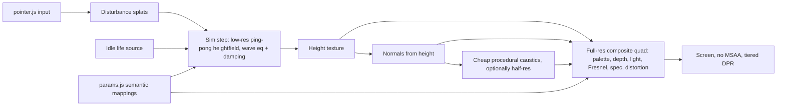

# Fluid

**INTERACTIVE WATER STUDY**

*a digital study of water, light, and motion*

---

## Concept

Fluid is a full-screen browser experience that treats water as both subject and interface. It is a calm, tactile study of light and motion—not a simulator, game, or conventional web app. The user is invited to touch, tune, and linger; there is nothing to complete.

Code is used here as a visual and interactive medium. Quality of feeling matters more than technical completeness.

---

## Core Question

> Can a browser interaction feel calming without asking the user to accomplish anything?

---

## Product Principles

1. **Water is the interface** — The surface fills the screen; UI stays secondary and intentional.
2. **Calm over spectacle** — Prefer gentle presence over dramatic effects.
3. **Interaction without objectives** — Response is sensory, never task-driven.
4. **Visual quality over feature quantity** — One beautiful surface beats many incomplete techniques.
5. **Subtlety over simulation complexity** — Believable feel first; physical accuracy only if it serves feeling.
6. **Responsive but not hyperactive** — Motion answers the user, then settles; never frantic.
7. **Performance is part of the experience** — Stutter breaks calm; frame stability is aesthetic.
8. **Controls should feel sensory, not technical** — Human-readable language; no raw shader jargon in production UI.

---

## Visual Direction

### Reference image observations

Two primary references (shallow pool water, top-down, no environment):

- **Shared:** Full-frame water; cyan/blue/turquoise range; luminous caustic networks; soft rippling distortion; glassy highlights; no horizon, skybox, floor tiles, foam, or scenery.
- **Reference A (cooler):** Deeper cerulean with navy troughs; sharper white caustic web; clear specular glints; faint concentric ripple suggesting localized disturbance.
- **Reference B (brighter):** Turquoise / aqua luminosity; denser, slightly softer caustic mesh; same edge-to-edge abstract composition.

**Default lean:** cooler deep blue (Reference A), while keeping overall mood a balanced blend—not extremely dark and not extremely turquoise.

### Style blend (binding)

- **Realistic light behavior**, but **artistic and stylized** overall—not photo-real ocean rendering.
- Caustics: **start softer**; introduce **sharper caustic webs** in a later visual phase once the surface is stable.
- Lighting: **crisp caustic behavior** combined with otherwise **soft lighting**.

### Color direction

- Base palette: cool blues / deep cyan with luminous white highlights.
- Public control: **warm ↔ cool** plus a **full hex-code color picker** (not presets-only).
- Subtle chromatic variation is desirable; avoid tropical beach clichés.

### Lighting

- Soft ambient fill + directional contribution for form.
- Specular / glassy highlights where the surface catches light.
- Caustic-like luminous streaks as a defining character trait (soft first, sharper later).

### Surface behavior

- Gently alive idle motion (soft overlapping ripples).
- Organic, non-repeating patterns—avoid flag/fabric wave look.
- Infinite, edge-to-edge field; no pool walls or world edges.

### Camera angle

- **Strict top-down.**
- Prefer orthographic (or equivalent top-down framing) so the surface reads as a continuous plane.
- Water fills the viewport completely.

### Caustics

- Essential to the look; secondary to calm motion early on.
- Progression: soft luminous hints → sharper web-like structure when approved.
- Should feel pool-like, not disco or noisy.

### Reflectivity / translucency

- Glassy regions and view-angle–dependent brightness.
- Public axis: **reflective ↔ translucent**.
- No environment map of scenery; reflections stay abstract / self-contained.

### Distortion

- Soft refractive / liquid-glass distortion of subsurface light patterns.
- Gentle, not warping or nauseating.

### What to avoid

- Hyper-realistic ocean simulation
- Horizons, skyboxes, environment scenery
- Foam, boats, rocks, tropical beach aesthetics
- Heavy UI chrome / “tech demo” styling
- Rapid flashing or intense motion
- Feature creep disguised as visual polish

---

## UX Principles

- **Full-screen experience** — Canvas is the page; water is primary.
- **No onboarding** — No “touch the water” hint; discovery is natural.
- **Minimal UI** — Controls hidden/collapsed by default; revealed via small corner icon and keyboard shortcut.
- **Discoverable interactions** — Subtle proximity response + stronger move/click/tap response.
- **Idle state** — Gently alive baseline; after interaction, return to calm gradually and organically (**no obvious fixed timer**).
- **Pointer behavior** — Proximity influence; velocity strengthens disturbance; click/tap ripple; hold behavior **undecided** (do not lock in).
- **Touch behavior** — **Single-touch only for MVP**; gestures should feel natural; portrait composition adapted carefully (not naive crop).
- **Reduced motion** — Honor `prefers-reduced-motion` as a default hint, but **let the user choose** the reduced-motion behavior rather than forcing a single policy.
- **Keyboard** — Opens and tunes controls only; **no keyboard-triggered ripple**.
- **Mobile expectations** — Graceful visual downgrade; same calm intent; single touch; portrait-aware framing.
- **Settings persistence** — Controls **reset every visit**; do **not** persist to `localStorage`.
- **Browser title** — `Fluid`
- **Audio** — Future possibility only; **not MVP**.

---

## MVP Scope

### MVP (deliberately small)

- Full-screen WebGL water surface (Vite + Three.js + custom GLSL)
- Strict top-down, edge-to-edge infinite feel
- Custom vertex + fragment shaders with slow procedural motion
- Believable soft lighting and highlights; soft caustic-like luminosity (sharp caustics later)
- Cooler deep-blue default palette with balanced mood
- Simple pointer influence (proximity + velocity)
- Click / tap ripple
- Idle calming that feels organic (no hard countdown UX)
- Public tunable parameters (human-readable):
  - calm ↔ restless
  - glassy ↔ turbulent
  - warm ↔ cool
  - reflective ↔ translucent
  - light
  - full hex-code color selection
- Custom minimal control panel (corner icon + keyboard shortcut); reset on each visit
- Responsive desktop / mobile canvas with portrait-aware composition
- User-selectable reduced-motion behavior
- Desktop-first quality; graceful mobile downgrade; drop expensive effects before falling below ~30fps on mid-range mobile
- Pause rendering when tab is hidden
- Static Vercel deployment

### Nice-to-have

- Phase 6.5 caustic study polish after visual feedback (density / sharpness / warp)
- Hold-to-disturb (once behavior is decided)
- Soft fade-in / polished control transitions
- Social preview image / richer metadata
- Low-power explicit fallback mode beyond automatic downgrades
- Subtle chromatic aberration or optical nuance (only if calm is preserved)

### Future experiments

- Audio (ambient / water-responsive)
- Multi-touch influence
- Splash-like moments (evaluate by feel)
- ~~GPGPU / ping-pong heightfield simulation (only if simple math ripples fail to feel right)~~ — **adopted 2026-09-29**; see [Architectural Pivot](#architectural-pivot)
- Additional sensory macro controls
- Persistence of settings (explicitly out of current product decision)

---

## Technical Architecture

### Stack (confirmed)

| Layer | Choice | Notes |
|-------|--------|--------|
| Build | Vite | Static site; fast HMR; Vercel-friendly |
| Runtime | Vanilla JavaScript | No React unless a clear need appears later |
| Renderer | Three.js `WebGLRenderer` | Scene, camera, resize, animation loop |
| Material | `ShaderMaterial` + custom GLSL | Vertex + fragment as separate modules |
| Dev controls | Tweakpane (temporary) | Swap for custom minimal UI before production polish |
| Deploy | Vercel | Static Vite output only |

**Avoid unless scope changes:** backend, serverless functions, databases, auth, external APIs, heavy postprocessing stacks, physics engines.

### Suggested project structure

```text
fluid/
  PROJECT.md
  index.html
  package.json
  vite.config.js
  public/
    favicon.svg
    og-image.png          # later (Phase 10)
  src/
    main.js               # bootstrap
    app/
      createApp.js        # scene / camera / renderer / loop
      resize.js
      visibility.js       # pause when tab hidden
    render/
      createWaterMesh.js  # plane + ShaderMaterial wiring
      camera.js           # top-down setup
    shaders/
      water.vert.glsl
      water.frag.glsl
    interaction/
      pointer.js          # proximity, velocity, click/tap
      idleCalm.js         # organic return toward calm
    controls/
      devGui.js           # Tweakpane (dev phases)
      panel.js            # custom production panel
      params.js           # centralized tunable state
    style.css
```

Preserve clear separation: **app setup · rendering · shaders · interactions · controls**.

### Three.js scene

- One full-screen (or oversized) plane; water is the only subject.
- Strict top-down camera; framing keeps the surface edge-to-edge at all aspect ratios.
- Portrait: adapt plane scale / camera framing carefully so composition still feels like continuous water (not a cropped desktop shot).

### Geometry

- `PlaneGeometry` with modest segment count—enough for vertex displacement, not excessive.
- Prefer fragment-driven detail (normals, caustics, color) over huge meshes.

### Shaders & uniforms

- Vertex: displacement / wave contribution.
- Fragment: color, lighting, Fresnel-like terms, distortion, caustic-like highlights.
- Uniforms clearly named and documented; experimental values centralized in `params.js` (or equivalent).

### Animation loop

- `requestAnimationFrame` via Three.js or thin wrapper.
- Pass time, pointer state, and params into uniforms each frame.
- Pause when `document.visibilityState === 'hidden'`.

### Pointer input

- Normalized device / UV-space coordinates.
- Track position, velocity, down/up for click-tap ripples.
- Single-touch path on mobile for MVP.
- Hold behavior left open in code design (pluggable, not committed).

### Responsive resize

- Update renderer size, camera, and any aspect-dependent uniforms.
- Cap `devicePixelRatio` (e.g. 1.5–2 on desktop; lower on mobile as needed).

### Performance strategy

- Target **60fps** where practical; accept **30–60fps** on mobile.
- Desktop visual quality first; **drop expensive effects** before sustained sub-30fps on mid mobile.
- Adaptive pixel ratio; visibility pause; avoid oversized geometry and unjustified textures/postprocessing.

### Control panel architecture

- **Development:** Tweakpane bound to centralized params.
- **Production:** Custom minimal panel; same params object; corner icon + keyboard shortcut; no `localStorage`.

### Vercel deployment

- Standard Vite static build (`vite build` → `dist`).
- No server-side architecture.

---

## Shader Strategy

Progress incrementally. **Do not attempt all steps at once.**

1. Simple sine-wave displacement  
2. Layered wave functions / careful noise  
3. Procedural normals  
4. Height-based color  
5. View-angle calculations  
6. Directional light  
7. Specular highlights  
8. Fresnel  
9. Refraction / distortion  
10. Soft caustic-like highlights → later sharper caustic webs  

Each roadmap phase maps to a subset of this ladder. Prefer readable shader code over clever abstractions.

---

## Interaction Strategy

**Start simple (mathematical / CPU-side influence into uniforms):**

- Pointer coordinate influence (including subtle proximity)
- Fake mathematical ripple on click/tap
- Velocity-based disturbance strength
- Organic idle calming (continuous easing toward baseline—not a visible timer)

**Only consider later if simple approach cannot achieve the desired feel:**

- Framebuffer simulation  
- Ping-pong FBO  
- `GPUComputationRenderer` / GPGPU heightfields  

Hold behavior remains an **open question**; do not implement a locked hold model until decided.

> **Superseded 2026-09-29:** profiling showed the simple math approach cannot feel tactile (no shared state). The ping-pong heightfield fallback is now adopted — see [Architectural Pivot](#architectural-pivot) and [Replacement Roadmap](#replacement-roadmap).

---

## Controls Strategy

### Development

- Temporary **Tweakpane** (or equivalent) for rapid tuning.
- May expose more parameters than production.

### Production (binding)

| Control | Intent |
|---------|--------|
| calm ↔ restless | Overall motion energy |
| glassy ↔ turbulent | Surface character / roughness of motion |
| warm ↔ cool | Temperature shift of palette |
| reflective ↔ translucent | Optical balance |
| light | Illumination intensity / presence |
| hex color | Full color input/picker (base water hue) |

- Small, unobtrusive, collapsed by default  
- Reveal: **corner icon + keyboard shortcut**  
- Labels human-readable; no raw shader variable names  
- **Reset every visit** (no persistence)  
- Visually secondary to the water  

---

## Performance Budget

- Smooth **60fps** target on typical desktop  
- Acceptable **30–60fps** on mobile; prefer dropping effects over prolonged sub-30fps on mid-range devices  
- Adaptive / capped `devicePixelRatio`  
- Pause rendering when tab is hidden  
- Avoid oversized geometry  
- Avoid unnecessary postprocessing  
- No huge textures unless justified  
- Lazy-load anything nonessential  
- Low-power / reduced-effect fallback path as needed for mobile gracefulness  

---

## Accessibility

- Respect `prefers-reduced-motion` as an initial signal, but **allow the user to choose** reduced-motion behavior in the UI  
- Keyboard access for opening and operating controls  
- Readable control labels  
- Sufficient contrast on UI chrome (water itself may be low-contrast by nature)  
- No essential experience path that requires pointer-only **for controls**; water play may remain pointer/touch-primary  
- Avoid rapid flashing / intense motion  
- Provide a way to reduce motion intensity (via calm control and/or reduced-motion choice)  
- No keyboard-triggered ripple required  

---

## Development Roadmap

Highly incremental. **Never implement multiple phases without approval.**  
At the start of every coding session: **read this file first.**  
After each phase: summarize changes, explain important shader math in plain English, list what to evaluate manually, and ask whether to tune or proceed.

> **Status 2026-09-29:** Phases 0–6.5 are complete and define the visual target. **Phases 7–10 are paused** in favor of the [Replacement Roadmap](#replacement-roadmap). Phase 7 (idle calm) folds into simulation damping and the Stage D idle source; Phases 8–9 fold partly into Stage F; remaining Phase 8 items and Phase 10 resume after Stage G.

### PHASE 0 — Setup

**Goal:** Project foundation only.

**Tasks:** Vite, Three.js, basic canvas, resize handling, scene/camera/renderer, plain test plane, Vercel sanity deploy.

**Exit criteria:** Empty Three.js scene renders; responsive canvas works; deployment works; **no water visuals yet**.

**STOP** — ask for approval.

### PHASE 1 — Basic Water Surface

**Goal:** First visual water study.

**Tasks:** Plane + custom `ShaderMaterial`; simple vertex displacement; 2–3 layered sine waves; slow movement; basic blue/cyan gradient (cooler deep-blue lean).

**Exit criteria:** Water-like calm motion; no pointer interaction; no Fresnel / refraction / caustics / controls.

**STOP** — ask for visual feedback.

### PHASE 2 — Surface Character

**Goal:** More organic surface.

**Tasks:** Layered procedural motion; careful noise; improved procedural normals; height-based color; tune scale/frequency.

**Exit criteria:** No longer flag/fabric-like; begins to resemble references; still calm.

**STOP** — ask for visual feedback.

### PHASE 3 — Lighting

**Goal:** Light defines the surface.

**Tasks:** Directional lighting; specular highlights; view-dependent brightness; **soft** caustic-like streaks if feasible (sharp webs later).

**Exit criteria:** Luminous depth; pool-inspired highlights without noise.

**STOP** — ask for visual feedback.

### PHASE 4 — Fresnel + Optical Effects

**Goal:** Liquid / glass character.

**Tasks:** Fresnel; reflective ↔ translucent balance groundwork; subtle refraction/distortion; color depth adjustments.

**Exit criteria:** More liquid/glassy; believable view-angle behavior; no expensive effects without justification.

**STOP** — ask for visual feedback.

### PHASE 5 — Pointer Interaction

**Goal:** Water responds to the user (simple math first).

**Tasks:** Normalized pointer coords; proximity influence; velocity detection; click/tap ripple; organic idle calming. **Do not lock hold behavior.**

**Exit criteria:** Organic, subtle response; not game-like; single-touch mobile works.

**STOP** — ask for interaction feedback.

### PHASE 6 — Controls

**Goal:** Tunable experience.

**Tasks:** Dev controls first for motion, optical, light, color axes; then custom minimal UI with the binding public set (including hex color); corner icon + keyboard shortcut; no persistence.

**Exit criteria:** Only useful public parameters; human-readable labels; UI does not overpower water.

**STOP** — ask for UX feedback.

### PHASE 6.5 — Caustic Study *(roadmap pause — before Phase 7)*

**Goal:** Fine-scale, animated, interconnected caustic light networks inspired by the reference images — the missing micro layer between broad water motion and concentrated sunlight.

**Context:** Phase 1–6 establish organic motion, depth, optics, interaction, and controls. Soft `softCaustics` only brightens existing mid-scale lit ridges and cannot produce thin branching webs. Do **not** proceed to Phase 7 until this study is visually approved (or explicitly deferred).

**Tasks:**
- Inspect why current soft caustics read as broad ridges (not fine networks)
- Implement a dedicated procedural caustic field (prefer single-pass shader; no static caustic texture unless justified)
- Preserve macro water; caustics ride on / emerge from it
- DEV-only temporary controls (intensity, density/scale, sharpness, warp, speed); do not dump into production panel
- Keep pointer, idle, hold, and unrelated Phase 1–6 systems unchanged unless required for compatibility

**Visual target:** Thin luminous lines; irregular cellular branching; varying thickness/brightness; brighter intersections; continuous organic evolution; no tiling / grid / zebra / lightning / cracked-glass look; pale cyan → blue-white (rare near-white nodes); start moderately dense.

**Exit criteria:** Fine caustic network clearly distinct from broad ridges; evolves with the water; reads substantially closer to sunlit pool references; calm preserved; mobile remains performant (~60 desktop / effects drop before sustained &lt;~30 mobile).

**STOP** — ask for visual feedback; do **not** proceed to Phase 7.

### PHASE 7 — Calm / Idle Behavior

**Goal:** Inactivity is part of the experience.

**Tasks:** Detect idle in a soft way; gradually reduce disturbance; return toward calm baseline organically; refine calm ↔ restless as macro if needed.

**STOP** — ask for feedback.

### PHASE 8 — Mobile + Accessibility

**Tasks:** Touch tuning; user-selectable reduced motion; keyboard control access; viewport / portrait framing; DPR strategy; orientation testing; mobile effect downgrades.

**STOP** — ask for approval.

### PHASE 9 — Performance

**Tasks:** Measure frame/GPU cost; optimize geometry/shader work; adaptive DPR; visibility pause; test integrated GPU / mobile; **report findings before cutting visual quality**.

**STOP** — report findings.

### PHASE 10 — Polish

**Tasks:** Soft fade-in; control transitions; favicon/title/metadata (`Fluid`); loading only if needed; screenshot / social preview; final responsive pass; production Vercel deploy.

**Optional later (post-MVP):** sharper caustics; hold behavior; audio experiments.

---

# Architectural Pivot

*Decided 2026-09-29, after the architecture profiling pass. This is a **partial** replacement, not a rewrite.*

**Keep:** Vite · Three.js · `WebGLRenderer` / WebGL2 · orthographic top-down camera · Vercel · existing app shell · approved palette · approved lighting / optical ideas where practical · current caustic appearance as a **visual reference** · public UI concept · pointer / touch input handling where reusable.

**Replace:** the stateless procedural surface as the primary interaction surface · the stateless analytic ripple system · the expensive full-resolution caustic implementation.

**New direction:** low-res GPU water simulation **+** full-res visual composite **+** cheaper procedural caustics.

### 1. Why the original stateless approach was insufficient

- Every vertex (surface) and every pixel (caustics) evaluates height and light as `f(position, time, uniforms)`. Nothing persists between frames — there is **no shared water state**.
- Without state, a touch cannot leave a trail, energy cannot travel outward, ripples cannot interfere with each other or the idle waves, and the surface cannot settle on its own. Those are exactly the tactile qualities this project wants ("responsive but not hyperactive", "return to calm organically").
- Pointer influence is visually weak relative to idle motion: the proximity bump's peak slope is ~0.02 and the wake's ~0.03, against ~0.24 for the idle waves. Lighting is slope-driven, so the pointer barely changes the image.
- The wake is shaped around the *current* cursor position only and vanishes ~100 ms after the pointer stops. Tap ripples are 4 closed-form slots (`A·sin(k·r − ω·t)·e^(−αr)·e^(−βt)`) that ignore each other and the waves.
- Adding "memory" through more uniforms makes every pixel's formula longer and more expensive. The approach scales in the wrong direction.

### 2. What the profiling revealed

**Measured** (Apple M2, Chromium via ANGLE/Metal, `EXT_disjoint_timer_query_webgl2`, one draw per frame):

| Finding | Value |
|---------|-------|
| Full fragment shader at 1920×1080 | ~9.0 ms |
| Fine caustic network (2 Worley passes + 5 value-noise calls) | ~6.9 ms (**~77%** of fragment time) |
| Fragment shader with caustics removed | ~2.1 ms |
| Second Worley pass alone | ~2.6 ms |
| 4× MSAA on a full-frame plane | +2.7 ms (+27%), no visible benefit (no silhouette edges) |
| Vertex stage (80×80 grid, height evaluated 5× per vertex) | ~0.2 ms |
| Fresnel + specular + color model + soft streaks combined | ~1.5 ms above bare fill |
| Live page, 1706×1544 buffer (2.63 MP) | ~10–11 ms GPU, 60 fps |
| Idle vs hover vs 4 active ripples | no measurable difference |
| Shader compile + link | ~200 ms uncached, ~15 ms cached |

**Known from code:** DPR capped at 2 for every device; no quality ladder, adaptive resolution, or effect downgrade; full-quality shader starts immediately; no fallback if WebGL context creation fails; the 80×80 grid undersamples higher turbulence and stretches along the long axis in portrait (visible faceting).

**Inferred (not measured):**
- Full-screen 13" Retina (~5.6 MP) → ~21–34 ms per frame, i.e. 30–45 fps even on an M2.
- Mid-range phones → roughly 25–80 ms per frame.
- The Lighthouse "page stopped responding" failure is most plausibly headless Chrome running WebGL through a software rasterizer (SwiftShader), executing this shader on the CPU every frame. Not confirmed by a Lighthouse run.

**Controls:** "great at default, bad quickly" comes from shading thresholds tuned to the default slope/height range (`smoothstep` slope gates, `vHeight × 9` / `× 14`, `NdotV^11.5` Fresnel expansion), deliberately amplified mappings (×2.8, ×6, `^1.65`), a glassy↔turbulent default at only 14% of its travel, additive light with a hard `clamp` and no tone mapping, and ambient / specular colors hard-coded cyan regardless of the chosen hex.

### 3. Why Three.js / WebGL2 is retained

- The renderer, camera, and one-draw pipeline were measured as **sound**. The cost is in shader *content*, not the framework.
- WebGL2 provides what a simulation needs: float / half-float render targets and multi-pass ping-pong through `WebGLRenderTarget`.
- Keeping it preserves Vite, Vercel, the app shell, the control panel, and the input code — avoiding an unnecessary rewrite.

### 4. Why the water core is being replaced

- A low-resolution GPU heightfield (discrete wave equation + damping) gives real shared state for roughly 0.1–0.5 ms per step *(inferred)*: propagation, interference, trails, natural decay, and direct pointer writes.
- Height and normals come from a texture sampled bilinearly at full resolution instead of being interpolated across an 80×80 vertex grid, removing the grid faceting.
- A simulation exposes physically meaningful parameters (wave speed, damping, injected energy) that semantic controls can map onto cleanly, instead of one slider fanning out to ~14 coupled uniforms.

### 5. Why caustics will later be rebuilt more cheaply

- They are the dominant GPU cost (~77% of fragment time) and the main mobile and Lighthouse risk.
- They are only loosely coupled to the surface: the surface nudges where the web is sampled (~0.015 world units under the cursor vs ~0.5-unit cells), but a ripple cannot carve the web.
- The approved look is a **parameter set and design** — Worley F2−F1 lines, brighter intersections, varying thickness, palette-derived tints — not an engine. It can be rebuilt at ≤ ~1/3 of the cost with simulated normals driving the warp.
- They are rebuilt only after the new surface exists (Replacement Roadmap Stage E), so they are designed around the real surface rather than the old one.

### 6. Existing visual work being preserved

Regardless of implementation, these must survive the replacement:

- **Palette:** `#2a7a9c` / `#3f9bb8` / `#6bc4d4`; `derivePalette` with `MID_OFFSET` / `SHALLOW_OFFSET`; the HSL formulas that derive `uCausticTint` / `uCausticHot` from the shallow stop.
- **Color-space behavior:** palette colors are written via `setRGB` / `setHSL` (no sRGB→linear conversion), while `LIGHT` hex colors *are* linear-converted by Three.js. A port must reproduce this mix or the approved colors will shift.
- **Lighting and optics:** `LIGHT` and `OPTICS` values — dual-lobe Blinn-Phong specular, Schlick Fresnel with `fresnelViewContrast` 11.5 (the top-down Fresnel fix), reflective ↔ translucent blend, normal-tied distortion, color-depth model.
- **Caustic visual reference:** `CAUSTIC_NET` baseline (intensity 1.10, scale 2.0, sharpness 0.375, warp 0.42, speed 0, soft 0.13), `CAUSTIC_CLAMPS`, the Worley F2−F1 design, and a golden reference screenshot captured before Stage A.
- **Macro surface character:** `WAVE_A`–`WAVE_D` directions / frequencies and `NOISE` scales, as the target for idle motion.
- **Input handling:** `clientToWorld`, Pointer Events + Touch Events fallback, single-touch logic, `TAP_MOVE_THRESHOLD`, `setSuppressed` during UI use, reduced-motion attenuation.
- **App shell:** orthographic top-down camera and aspect framing (`resize.js`), visibility pause, `dt` clamp, skipping wall-clock time while hidden.
- **Public UI:** axis names (calm ↔ restless, glassy ↔ turbulent, reflective ↔ translucent, light, hex), panel UX (corner icon, collapsed by default), reset every visit.

### 7. New intended rendering pipeline



Per frame:

1. **Input** — `pointer.js` converts pointer / touch into queued disturbance splats (position, radius, strength from velocity).
2. **Simulation** — N fixed-timestep substeps on a low-res, aspect-matched ping-pong heightfield (half-float): wave equation + damping + splats + idle life source.
3. **Normals** — derived from the height texture (central differences), inline or as a small pass.
4. **Caustics** — cheap procedural field warped by simulated normals; optionally rendered at reduced resolution.
5. **Composite** — one full-screen quad at display resolution: palette / depth color, lighting, Fresnel, specular, distortion, caustic contribution.
6. **Screen** — no MSAA; device pixel ratio chosen by a quality tier.

**Expected module layout** (created incrementally, stage by stage):

| File | Role | Stage |
|------|------|-------|
| `src/sim/createWaterSim.js` | Render targets, step, splat queue, resize | A–B |
| `src/shaders/sim/simStep.frag.glsl` | Wave equation, damping, splats | A–B |
| `src/shaders/fullscreen.vert.glsl` | Shared full-screen quad vertex | A |
| `src/shaders/simDebug.frag.glsl` | Height / normal debug views | A–C |
| `src/render/createSurfaceComposite.js` | Full-screen composite material wiring | D |
| `src/shaders/surface.frag.glsl` | Ported shading consuming sim height / normals | D |
| `src/render/lookConstants.js` | Palette, `LIGHT`, `OPTICS`, `CAUSTIC_NET` moved out of `createWaterMesh.js` | D |
| `src/shaders/caustics.glsl` (+ optional `src/render/createCausticPass.js`) | Rebuilt caustics | E |
| `src/render/quality.js` | Tiers, capability detection, frame-time monitor | F |

Modified along the way: `src/app/createApp.js` (sim step in loop, flags), `src/app/resize.js` (sim resize, DPR tiers), `src/interaction/pointer.js` (output becomes splats), `src/controls/params.js` (Stage G). Expected unchanged: `src/controls/panel.js`, `src/render/camera.js`, `src/app/visibility.js`, `index.html`, `vite.config.js`, `vercel.json`. Retired only after Stage E approval (owner decides): `src/render/createWaterMesh.js`, `src/shaders/water.vert.glsl`, `src/shaders/water.frag.glsl`, possibly `createCausticStudyGui` in `devGui.js`.

---

# Replacement Roadmap

**Process rules (binding):**

- One stage at a time. **Never implement multiple stages without approval.**
- Every stage ends in a small, working, evaluable result — then **STOP** for owner feedback.
- No giant rewrite: the old pipeline keeps working until the new one earns its place.
- During Stages A–C the new pipeline lives behind a `?sim` URL flag; the public app stays unchanged.
- From Stage D the new pipeline becomes the default; the old one stays reachable via `?legacy` for side-by-side comparison until Stage E is approved.
- Old files are retired only with explicit owner approval.

**Prerequisite before Stage A:** capture a golden reference screenshot of the current build at default settings (desktop landscape + phone portrait) and record the current performance baseline (~10 ms GPU at 2.63 MP on the M2). Every later visual comparison is made against these.

**Relationship to the original phases:** Phases 0–6.5 are complete and define the visual target. Phases 7–10 are paused. Phase 7 (idle calm) is absorbed by simulation damping and the Stage D idle source; Phases 8–9 (mobile, performance) are partly absorbed by Stage F; remaining Phase 8 items (reduced-motion choices, keyboard shortcut, orientation testing) and Phase 10 (polish) resume after Stage G.

### Stage A — Simulation proof of concept

**Goal:** Prove a stateful low-res heightfield runs cheaply and stably in this stack.

**Implements:**
- Ping-pong half-float render targets, aspect-matched to the viewport.
- Wave-equation step with damping, driven by a fixed-timestep accumulator.
- Dev-only automatic test drops (random positions on a timer).
- Debug view: full-screen quad showing height as a color ramp.
- Capability check for float / half-float render targets (clear console message if unsupported).
- All behind `?sim`.

**Does NOT implement:** pointer input, normals, lighting, palette, caustics, controls, quality tiers, removal of old code.

**Exit criteria:**
- Waves visibly propagate outward, interfere, and decay.
- No numerical blowup after several minutes.
- Same behavior at 30 / 60 / 120 Hz display rates (fixed timestep).
- Sim step GPU time measured (target < ~0.5 ms on the M2).
- Default app (no flag) is unchanged.

**Evaluate:**
- Simulation resolution: 128 / 192 / 256 on the long axis?
- Wave speed and damping ranges that feel calm rather than bouncy.
- Edge behavior: absorbing vs wrap — no visible box or reflections from screen edges.
- Half-float render-target support on iOS Safari.
- Do ripples still read as water when bilinearly upscaled?

**STOP** — ask for evaluation.

### Stage B — Pointer disturbance

**Goal:** The user's touch writes into the shared water state.

**Implements:**
- Reuse `pointer.js` input handling (coordinates, touch fallback, single touch, suppression, reduced motion); replace its analytic-ripple output with disturbance splats.
- Drag: splat along the full segment from previous to current position (no gaps); strength from velocity.
- Tap: a stronger single impulse.
- Still displayed through the debug view.

**Does NOT implement:** analytic ripples (not carried into the new path), normals, shading, hold behavior, control remapping.

**Exit criteria:**
- Drags leave trails that persist and spread.
- Taps ring outward; multiple taps interfere.
- Slow vs fast gestures are clearly distinguishable.
- Single-touch works on a real phone.
- Response feels immediate (no smoothing lag in the splat path).

**Evaluate:**
- Splat shape (Gaussian vs soft disc) and sign (push down vs lift).
- Does hover proximity (no press) stay, and how gently?
- Velocity curve and cap.
- Maximum injected energy that still feels calm.

**STOP** — ask for interaction feedback.

### Stage C — Simulation-driven normals

**Goal:** Smooth full-resolution normals derived from the height texture.

**Implements:**
- Central-difference normals from the height texture — inline in the full-res shader or as a separate normal pass at sim resolution, whichever compares better.
- A single normal-strength scalar.
- Debug views: normal visualization + a plain N·L directional light.

**Does NOT implement:** palette, Fresnel, specular, distortion, caustics.

**Exit criteria:**
- No texel blockiness or stair-stepping at full resolution on desktop or phone.
- Ripples read as smooth, lens-like bumps.
- The old 80×80 grid faceting is gone (including portrait).

**Evaluate:**
- Bilinear vs bicubic height sampling.
- Is sim resolution enough for fine ripples, or is a small procedural fine-normal detail needed?
- Inline normals vs separate pass (cost and quality).

**STOP** — ask for visual feedback.

### Stage D — Reconnect existing visual shading

**Goal:** The new surface wears the approved look (without caustics).

**Implements:**
- New full-screen composite (`surface.frag.glsl`) porting the shading stage of `water.frag.glsl`: height / slope color, dual-lobe lighting, Fresnel with the view-contrast fix, reflective ↔ translucent blend, distortion, color depth, soft streaks.
- Consumes sim height and normals instead of `vHeight` / `vNormal`.
- Normalize sim height / slope into the ranges the approved thresholds expect.
- Choose and add an idle life source.
- Move approved constants out of `createWaterMesh.js` into `lookConstants.js`.
- Wire the existing panel through the current mappings (temporarily; may misbehave off-default until Stage G).
- New pipeline becomes the default; `?legacy` stays available.

**Does NOT implement:** caustic rebuild (the legacy caustic function may be toggled under a debug flag purely for comparison), mapping rework, quality tiers.

**Exit criteria:**
- Side by side with the golden reference at defaults: body color, depth, highlights, and Fresnel read as the same family.
- Idle feels gently alive, not flat.
- Touches visibly change the lighting (the "weak" problem is solved).
- GPU cost measured.

**Evaluate:**
- Idle source: cheap procedural macro layer added in the composite, or gentle forcing injected into the simulation?
- Height / slope normalization values.
- Does the look drift because slope statistics differ from the old surface?

**STOP** — ask for visual feedback.

### Stage E — Rebuild caustics around the new surface

**Goal:** The approved caustic look at a fraction of the cost, visibly bent by ripples.

**Implements:**
- Cheaper procedural caustic field: `sin`-free hash, one Worley pass (a second only if needed), fewer value-noise calls.
- Warp driven by simulated normals, strong enough that ripples carve the web.
- Optional reduced-resolution (e.g. half-res) caustic target, upsampled.
- Palette-derived caustic tints preserved.

**Does NOT implement:** physically traced caustics (photon / refraction mesh), quality-tier tuning.

**Exit criteria:**
- Close to the golden reference: thin branching lines, brighter intersections, varying thickness, no tiling / grid / zebra look.
- Cost ≤ ~1/3 of the old ~6.9 ms at 1080p on the M2.
- Ripples visibly bend the caustics.
- No shimmer on phones.
- `?legacy` can then be retired (owner approval).

**Evaluate:**
- Is reduced resolution crisp enough?
- One vs two Worley layers.
- Independent caustic animation (the old default speed was 0) or surface-driven only?
- Coupling strength between ripples and the web.
- A physically inspired alternative that follows where simulated normals converge.

**STOP** — ask for visual feedback.

### Stage F — Performance / quality ladder

**Goal:** Stable frame rates on every device; Lighthouse completes.

**Implements:**
- Quality tiers (`quality.js`): DPR caps, sim resolution, caustic resolution / layers.
- MSAA off.
- Start at a conservative tier and step up; runtime frame-time monitor with hysteresis steps down.
- Half-float fallback path.
- WebGL failure and context-loss fallback (static deep-color background).
- Software-renderer detection → lowest tier.

**Does NOT implement:** new visuals, control remapping.

**Exit criteria:**
- 60 fps full-screen on an M2 MacBook Air.
- ≥ 30 fps on a real mid-range phone.
- Lighthouse completes a run.
- Tier changes cause no visible pops.

**Evaluate:**
- Tier boundaries (pixel count, frame time).
- Are tier switches noticeable?
- Is a user-facing low-power option needed?

**STOP** — report measurements.

### Stage G — Rebuild semantic control mappings

**Goal:** Every slider position looks intentional.

**Implements:**
- calm ↔ restless → idle energy, wave speed, pointer strength.
- glassy ↔ turbulent → damping, fine detail / normal strength, caustic warp.
- reflective ↔ translucent → optical balance, Fresnel, color depth.
- light → illumination with soft tone mapping instead of a hard clamp.
- hex → palette plus palette-derived ambient / specular tints (fixes muddy warm colors).
- Normalized shading so thresholds don't saturate at slider extremes.
- Defaults placed sensibly along each slider (not at 14% of travel).

**Does NOT implement:** new axes (warm ↔ cool stays omitted unless re-decided), settings persistence.

**Exit criteria:**
- Screenshots at min / default / max for every axis, plus pairwise extremes, are all acceptable.
- No wash-out, posterization, or faceting at any setting.
- Warm and unusual hex colors look clean.

**Evaluate:**
- Default positions and ranges.
- Whether to reintroduce warm ↔ cool.

**STOP** — ask for UX feedback.

---

## Development Rules

1. Never implement multiple roadmap phases without asking.  
2. At the beginning of every coding session, read `PROJECT.md` first.  
3. Before coding, state: current phase, goal, files expected to modify.  
4. Smallest possible implementation for that phase.  
5. Do not “improve” unrelated parts.  
6. Do not add dependencies without explaining why.  
7. Do not silently change visual direction.  
8. After each phase: summarize; plain-English shader notes; evaluation checklist; ask tune vs proceed.  
9. If complexity spikes, stop and explain tradeoffs.  
10. Prefer understandable shader code over clever abstractions.  
11. Keep shader uniforms clearly named and documented.  
12. Keep experimental values centralized for easy tuning.  
13. Preserve separation: rendering · shaders · interactions · controls · app setup.  

---

## Version Control

- Git is initialized in this repository.  
- **The project owner manages all commits.**  
- Do **not** suggest commit messages or automate commits unless explicitly asked.

---

## Deployment

- Target: **Vercel**  
- Normal static Vite deployment  
- No backend, serverless, database, auth, or external APIs unless scope is explicitly changed later  

---

## Decision Log

| Date | Decision |
|------|----------|
| 2026-09-19 | Stack: Vite, Three.js, WebGLRenderer, custom GLSL, vanilla JS, Vercel. No React by default. |
| 2026-09-19 | Visual blend: realistic light behavior, artistic/stylized overall. Soft caustics first; sharper later. |
| 2026-09-19 | Default palette leans cooler deep blue; overall mood balanced (not extreme dark or turquoise). |
| 2026-09-19 | Camera: strict top-down; infinite edge-to-edge water. |
| 2026-09-19 | Lighting: crisp caustic character + otherwise soft lighting. |
| 2026-09-19 | Idle: gently alive; return to calm gradual/organic, no obvious fixed timer. |
| 2026-09-19 | Interaction: proximity + stronger move/click; hold undecided; no hard exclusions yet. |
| 2026-09-19 | Controls: corner icon + keyboard; public set includes hex color picker; reset every visit; custom minimal production UI. |
| 2026-09-19 | Mobile: portrait-aware composition; single-touch MVP; no discovery hint. |
| 2026-09-19 | a11y: user chooses reduced-motion behavior; keyboard for controls only (no ripple). |
| 2026-09-19 | Performance: desktop-first with mobile grace; drop effects before sustained &lt;~30fps mid mobile; 60fps target where practical. |
| 2026-09-19 | Title: `Fluid`. Audio future-only. Owner manages Git; no unsolicited commit automation. |
| 2026-09-19 | Dev GUI: Tweakpane acceptable temporarily. |
| 2026-09-19 | Phase 0 complete: Vite + Three.js foundation, top-down orthographic camera, plain test plane, resize + visibility pause, local production build verified. Live Vercel deploy left for the project owner to run. |
| 2026-09-20 | Phase 2 complete: compact 2D value-noise FBM modulates sine phase/frequency + tiny height; finite-difference procedural normals; three-stop cool height/slope color. No lighting, caustics, interaction, or geometry density change. |
| 2026-09-20 | Phase 3 complete: Blinn-Phong directional lighting on Phase 2 normals; soft diffuse + pale-cyan specular; subtle top-down view lift; soft slope/NdotL caustic-like streaks. No Fresnel, refraction, reflection maps, pointer, or postprocessing. |
| 2026-09-20 | Phase 3 lighting refinement: dual-lobe specular (soft + narrow); streak variation from normal tilt align/cross + existing height/noise gates; slightly stronger directional contrast; soft caustic hints less parallel. Phase 2 displacement unchanged. |
| 2026-09-20 | **Phase 3 approved.** Directional lighting, specular response, luminous depth, and view-dependent surface definition are established. Remaining soft blue-gel quality is treated as **structural** (broad Phase 2 forms → broad lit ridges), not a lighting-strength problem. **Do not** endlessly sharpen or increase specular to chase the gel away. Preserve calm motion and the current organic foundation. Future phases should pursue missing water optics via Fresnel, reflectivity/translucency, refraction/distortion, and eventually more convincing caustic structure. |
| 2026-09-20 | **Surface frequency vs reference optics (pre–Phase 4 review):** Phase 2 is intentionally mid-to-broad (wave freqs ~5.5–21.5; noise scales ~0.58 / 1.55 / 3.6; 2-octave FBM; fine height muted). That supports calm organic motion and Phase 4 Fresnel / reflective–translucent / soft refraction well enough. It is **unlikely** to alone support the finer interconnected caustic webs in the references without a later dedicated high-frequency optical / caustic field and/or a controlled Phase 2 fine-scale normal refinement. **Flag only — do not rewrite Phase 2 surface now.** |
| 2026-09-20 | Phase 4 implemented: Schlick Fresnel on Phase 2 normals; internal `uOpticalBalance` reflective↔translucent blend; normal-tied analytic color distortion (no RTT); optical color depth. Phase 3 `viewLift` removed. No env maps, multipass refraction, pointer, controls, or camera change. Awaiting visual approval. |
| 2026-09-20 | Phase 4 diagnostic/tuning: initial Fresnel was visually flat (~0.025 everywhere) because top-down N·V≈0.96–1.0 makes `(1−N·V)^3.2` ≈ 0. Added `uFresnelViewContrast` to expand that band before Schlick; raised distortion / color-depth separation; slightly reduced Phase 3 specular + soft streaks so optics can read. Internal `uDebugOptics` (0–4) for isolation; default 0. Still awaiting visual approval. |
| 2026-09-20 | Phase 4 balancing pass: reduced Fresnel strength/contrast, pale sheen mix, and highlight contribution after overcorrection (too bright / frosted cyan). Restored mid/deep blue body under glass; `paleMask` gates near-white to stronger Fresnel only. Distortion left at 0.30. No Phase 2 surface changes. Still awaiting visual approval. |
| 2026-09-20 | **Phase 5 implemented:** `interaction/pointer.js` normalizes pointer to world XY (NDC × camera extents); smoothed/clamped velocity; soft proximity presence; up to 4 analytic tap ripples; continuous decay (no idle timer). Vertex height field absorbs influence so normals/lighting/optics respond. Single-touch Pointer Events; `prefers-reduced-motion` attenuates wakes/ripples. **Hold behavior intentionally unresolved** (down/up for tap only). No GPGPU / FBO / Phase 2–4 visual constant changes. Awaiting interaction feedback. |
| 2026-09-20 | Phase 5 tuning pass: stronger proximity/wake heights; snappier velocity + presence smoothing; clearer slow/medium/fast wake curve; larger/faster analytic ripples with near-immediate birth; mobile fix via `touch-action`, non-passive preventDefault, window-level pointer tracking, and touchstart/move/end fallback (single-touch). Decay mood preserved. Still awaiting interaction approval. |
| 2026-09-20 | **Roadmap pause before Phase 7.** Owner not yet satisfied with core visual vs references — missing fine interconnected caustic light networks. Soft `softCaustics` diagnosed as mid-scale normal/lighting brightening only (broad ridges), not a caustic field. **Phase 6.5 — Caustic Study** inserted: dedicated procedural fine caustic network (domain-warped multi-scale Worley F2−F1 ridges), macro water preserved, DEV-only tuning, no Phase 7 until visual feedback. |
| 2026-09-20 | **Phase 6.5 baseline locked + semantic mapping.** Approved caustic defaults: intensity 1.10, scale 2.0, sharpness 0.375, warp 0.42, speed 0, soft 0.130. Public axes derive offsets around baseline via `deriveCausticParams` (no public caustic slider). Density/scale internal. Palette-derived caustic tints. DEV panel shows live derived values; ephemeral overrides until public sync. Awaiting min/default/max slider visual approval before Phase 7. |
| 2026-09-20 | Phase 6.5 caustic study Tweakpane **unmounted** after mapping approval. Public Fluid panel is the sole UI; `createCausticStudyGui` kept in `devGui.js` for optional future retuning. |
| 2026-09-29 | **Architecture profiling complete → partial architectural replacement.** Keep Vite, Three.js / WebGL2, orthographic top-down camera, Vercel, app shell, palette, lighting / optics ideas, public UI concept, reusable input handling; current caustics kept as visual reference. Replace the stateless procedural surface, the analytic ripple system, and the full-res caustic implementation with: low-res GPU water simulation + full-res visual composite + cheaper procedural caustics. Phases 7–10 paused; work proceeds through Replacement Roadmap Stages A–G, one stage at a time with approval. |

---

## Open Questions

- **Hold behavior** — deeper sustained ripple, local calm, or something else? Defer until after Phase 5 feedback.  
- **Keyboard shortcut** for controls — exact key (e.g. `C` / `?` / `,`) not chosen yet.  
- **Corner icon** placement and visual design (which corner, mark vs wordmark).  
- **Reduced-motion user choices** — exact options (e.g. still frame / slow drift / no wakes) to be designed in Phase 8.  
- **Phase 6.5 caustic study** — baseline + semantic mapping approved; study Tweakpane hidden. Confirm Phase 7 when ready.  
- **Sharper caustics** — superseded in part by Phase 6.5; residual polish after study approval.  
- **Surface fine-scale / caustic frequency** — Phase 6.5 adds a dedicated high-frequency optical field without rewriting Phase 2 displacement.  
- **Orthographic vs perspective** top-down implementation detail (both can read as strict top-down; choose in Phase 0/1 for simplest framing).  
- Whether any **splash**, **multi-touch**, or **audio** experiments earn a place after MVP feel tests.  
- Exact **DPR caps** and mobile effect ladder (decide with Phase 8–9 measurements; now Stage F).  
- **Simulation resolution** — 128 / 192 / 256 on the long axis (Stage A).  
- **Simulation edge behavior** — absorbing vs wrap so screen edges never read as walls (Stage A).  
- **Idle life source** — procedural macro layer in the composite vs gentle forcing injected into the simulation (Stage D).  
- **Hover proximity** under the new model — keep a gentle hover disturbance or press-only (Stage B).  

---

## Non-Goals

- Physically perfect water simulation  
- Ocean simulation  
- Complex environment / skybox / scenery  
- Game mechanics or objectives  
- Unnecessary UI  
- Excessive realism for its own sake  
- Feature creep  
- Persisted settings (unless explicitly revised)  
- Audio in MVP  
- React or heavy frameworks without a clear reason  
- Backend or serverless architecture  

---

## Final Reminder

This is a visual experiment, not a feature checklist.

The goal is not every possible water technique.  
The goal is a water surface that feels **beautiful, calming, tactile, and intentional**.

**Quality > complexity.**
