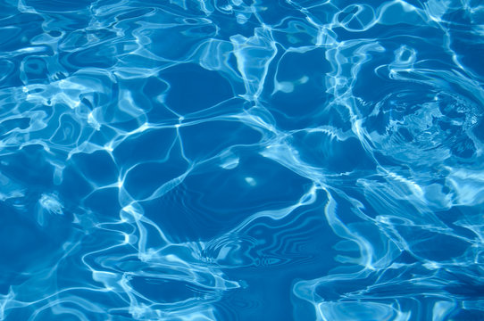
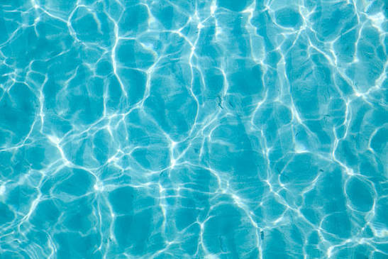
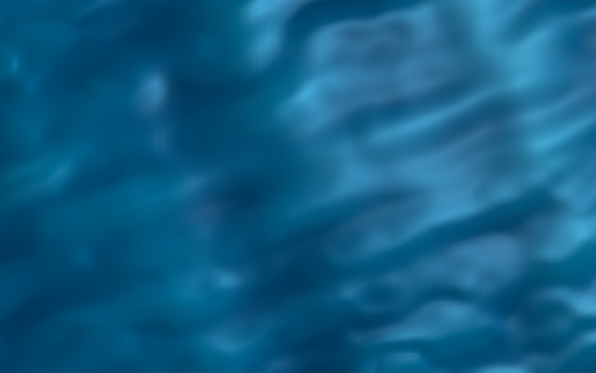
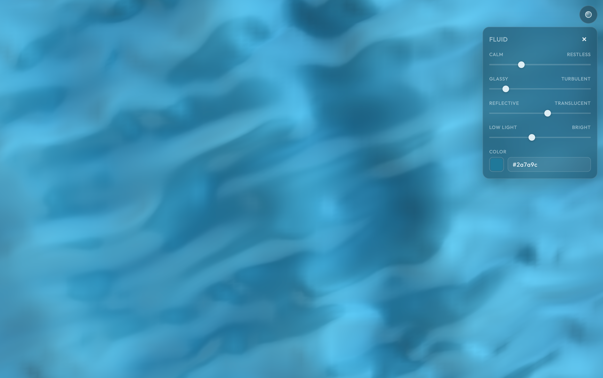
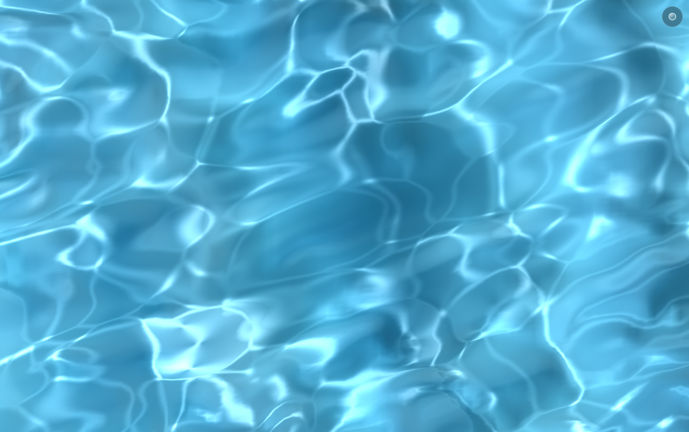

# Fluid

A digital study of water, light, and motion. Full spec lives in [PROJECT.md](PROJECT.md).

## Reference water

**Reference A (cooler)** — deep cerulean with navy troughs, sharp white caustic web, a faint ripple.

**Reference B (brighter)** — turquoise/aqua, denser and softer caustic mesh.

## Phase progression

### Phase 1 — Basic surface

Layered sine-wave displacement with a flat blue/cyan gradient. Calm but reads like fabric.

### Phase 2 — Surface character

Noise (FBM) breaks up the sine waves; procedural normals and height-based color make it more organic.

### Phase 3 — Lighting

Directional light, dual-lobe specular, soft caustic-like streaks. Adds depth, but the surface still looks like soft gel.

### Phase 4 — Fresnel + optics

Fresnel, reflective/translucent balance, subtle color distortion. A more glassy, liquid look.

### Phase 5 + 6 — Interaction + controls

Pointer wakes and tap ripples, plus the minimal Fluid panel (calm/restless, glassy/turbulent, reflective/translucent, light, hex color).

### Phase 6.5 — Caustic study

Dedicated procedural caustic field (domain-warped Worley ridges) that gives the fine, branching light network seen in the references.
